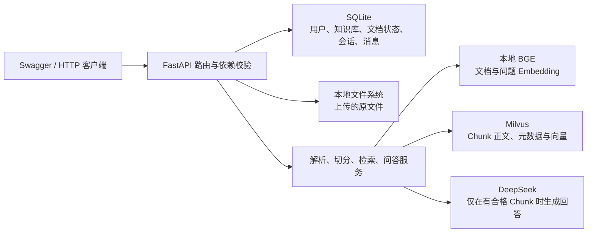
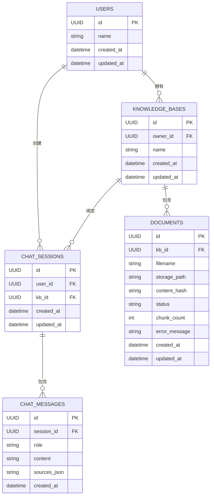

# Mini RAG Milvus

这是一个从空目录手写完成的 RAG 后端练习项目，通过 Swagger 完成全部操作。

技术栈：FastAPI、SQLModel、SQLite、LangChain、本地
`bge-small-zh-v1.5`、Milvus 和 DeepSeek。

## 完成状态

六个阶段均已实现：

1. 项目骨架与连接验证。
2. 用户、知识库与文档上传。
3. 文档解析、切分、Embedding 与 Milvus 入库。
4. 检索分数、阈值和知识库隔离。
5. 问答、直接拒答、引用和历史记录。
6. 文档幂等删除、日志、异常处理和自动化验收。

## 系统结构



SQLite 和 Milvus 不是替代关系：

- SQLite 保存业务身份和状态，是用户、知识库、文档、会话和消息的事实来源。
- Milvus 保存可检索的 Chunk、归属元数据和向量。
- `document_id` 将 SQLite 文档记录、本地原文件和 Milvus Chunk 关联起来。
- `user_id + kb_id` 同时用于接口授权和 Milvus 检索过滤。

## SQLite 数据库结构

SQLite 保存业务数据，共有 5 张表：



| SQLite 表 | 主要用途 | 关键关系 |
| --- | --- | --- |
| `users` | 保存基础用户身份 | `id` 被知识库和聊天会话引用 |
| `knowledge_bases` | 保存知识库及其所有者 | `owner_id → users.id` |
| `documents` | 保存原文件信息、处理状态和 Chunk 数 | `kb_id → knowledge_bases.id` |
| `chat_sessions` | 将一次聊天绑定到用户和知识库 | `user_id → users.id`，`kb_id → knowledge_bases.id` |
| `chat_messages` | 保存用户问题、助手回答和引用 JSON | `session_id → chat_sessions.id` |

`documents.status` 的生命周期为：

```text
UPLOADED
→ PROCESSING
→ READY 或 FAILED
→ DELETING
→ 删除记录或 DELETE_FAILED
```

`sources_json` 只保存在助手消息中，用于恢复回答引用；用户消息通常为
`NULL`。

## Milvus 数据库结构

所有用户和知识库共用一个 Collection：
`mini_rag_handwrite_chunks`。不同数据通过标量字段过滤，而不是为每个知识库
单独创建 Collection。

| Milvus 字段 | 类型 | 作用 |
| --- | --- | --- |
| `chunk_id` | `VARCHAR(64)`，主键 | Chunk 的 SHA-256 稳定身份，`auto_id=False` |
| `user_id` | `VARCHAR(36)` | 限制当前用户的数据范围 |
| `kb_id` | `VARCHAR(36)` | 限制当前知识库的数据范围 |
| `document_id` | `VARCHAR(36)` | 关联 SQLite 文档，并支持整篇文档精确删除 |
| `document_name` | `VARCHAR(1024)` | 回答引用中展示原文件名 |
| `page` | `INT64` | Chunk 所属原始页码 |
| `start_index` | `INT64` | Chunk 在当前页内的起始字符位置 |
| `chunk_index` | `INT64` | Chunk 在整个文档内的连续顺序 |
| `content` | `VARCHAR(8192)` | Chunk 正文，用于 Prompt 和引用摘录 |
| `content_hash` | `VARCHAR(64)` | Chunk 正文的 SHA-256 摘要 |
| `embedding` | `FLOAT_VECTOR(512)` | BGE 生成的归一化向量 |

Collection 的关键配置：

- 主键由应用生成，不让 Milvus 自动生成。
- `enable_dynamic_field=False`，禁止写入 Schema 外的未知字段。
- `embedding` 使用 `AUTOINDEX`。
- 相似度度量使用 `COSINE`。
- 检索过滤条件：`user_id + kb_id`。
- 文档删除条件：`user_id + kb_id + document_id`。

两个数据库通过以下字段关联：

```text
SQLite users.id
    ↕ user_id
Milvus Chunk

SQLite knowledge_bases.id
    ↕ kb_id
Milvus Chunk

SQLite documents.id
    ↕ document_id
Milvus Chunk 1、Chunk 2、Chunk 3……
```

SQLite 中一个 `Document` 对应 Milvus 中零到多个 Chunk。上传完成但尚未解析时，
SQLite 已有文档记录，而 Milvus 中还没有对应 Chunk；只有文档进入 `READY` 后，
这些 Chunk 才可以参与检索。

## 支持范围

- 文件：TXT、Markdown、普通 PDF、DOCX。
- 检索：COSINE 向量检索、Top-K、最低阈值、最终 Top-N。
- 引用：Chunk ID、文档 ID、文件名、页码、摘录和原始分数。
- 身份模拟：请求头 `X-User-ID`。
- 操作界面：Swagger。

本项目不包含 JWT、前端、OCR、表格专用解析、混合检索、Rerank、Agent
和后台任务队列。

## 配置

复制 `.env.example` 为 `.env`，至少确认以下配置：

```dotenv
DATABASE_URL=sqlite:///./data/mini_rag.db
FILE_STORAGE_DIR=./data/files
MILVUS_URI=http://localhost:19530
MILVUS_COLLECTION=mini_rag_handwrite_chunks
EMBEDDING_MODEL_PATH=../py-doc-deepseek-server/models/bge-small-zh-v1.5
DEEPSEEK_API_KEY=填写真实密钥
```

相对路径统一以项目根目录为基准。不要把包含真实密钥的 `.env` 提交到 Git。

本机只有 16 GB 内存时，建议只启动 Milvus 和当前项目，不同时运行
RAGFlow。

## 安装与启动

项目当前使用的独立 Python 环境：

```powershell
C:\D\venvs\mrh\Scripts\python.exe -m pip install -r requirements-dev.txt
```

确认 Milvus 已启动后，在项目根目录运行：

```powershell
C:\D\venvs\mrh\Scripts\python.exe run.py
```

打开：

- Swagger：<http://127.0.0.1:8000/docs>
- 健康检查：<http://127.0.0.1:8000/health>

也可以在 PyCharm 中直接运行根目录的 `run.py`。

## Swagger 调用顺序

1. `POST /users`：创建用户，记录返回的用户 ID。
2. 后续请求添加 `X-User-ID` 请求头。
3. `POST /knowledge-bases`：创建知识库。
4. `POST /knowledge-bases/{kb_id}/documents`：上传原文件。
5. `POST /knowledge-bases/{kb_id}/documents/{document_id}/parse`：同步解析入库。
6. `POST /knowledge-bases/{kb_id}/retrieval-test`：先验证召回和分数。
7. `POST /chat-sessions`：为知识库创建会话。
8. `POST /chat-sessions/{session_id}/messages`：提问。
9. `GET /chat-sessions/{session_id}/messages`：查看最近 20 条历史。
10. `DELETE /knowledge-bases/{kb_id}/documents/{document_id}`：删除文档。

所有 HTTP 响应都会返回 `X-Request-ID`。也可以由客户端传入符合格式的
`X-Request-ID`，用于关联服务端日志。

## 三条核心链路

### 文档入库

```text
接收用户上传的原文件，校验文件名和扩展名
→ 将原文件保存到 kb_id/document_id/文件名，并在写入时计算 SHA-256
→ 在 SQLite 中创建 Document 记录，状态标记为 UPLOADED（已上传、尚未解析）
→ 用户调用解析接口，将文档状态标记为 PROCESSING（正在解析和向量化）
→ 按 user_id + kb_id + document_id 删除 Milvus 中该文档的旧 Chunk
→ 根据 TXT、Markdown、PDF 或 DOCX 类型读取正文，并转换为带页码的页面
→ 逐页切分 Chunk，并保存 page、start_index 和 chunk_index 位置信息
→ 根据 document_id、页码、页内位置和正文，为每个 Chunk 生成稳定 chunk_id
→ 使用本地 BGE 模型批量生成 512 维归一化向量
→ 将 Chunk 正文、文档信息、引用位置和向量一起写入 Milvus
→ Milvus 写入成功后，将文档状态标记为 READY（已入库、可以检索）
→ 在 SQLite 的 Document 记录中保存实际写入的 chunk_count
```

解析失败时文档进入 `FAILED`，并保存可安全展示的错误摘要。重新解析总会先按
`document_id` 清理旧 Chunk，因此不会从 2 个累积为 4 个。

### 检索与问答

```text
读取 X-User-ID，并从 SQLite 确认该用户真实存在
→ 验证知识库或聊天会话属于当前用户，防止跨用户访问
→ 使用本地 BGE 模型将用户问题转换为 512 维归一化向量
→ 在 Milvus 中添加 user_id + kb_id 过滤条件，只检索当前知识库的数据
→ 使用 COSINE 相似度召回候选 Top-K=10 个 Chunk
→ 读取每个候选 Chunk 的原始相似度分数
→ 过滤掉 similarity < 0.50 的低相关 Chunk，等于 0.50 时保留
→ 将合格 Chunk 按分数从高到低排列，最多保留最终 Top-N=3 个
→ 没有 Chunk 通过阈值时直接返回“知识库中没有足够依据”，不调用 DeepSeek
→ 存在合格 Chunk 时，依次编号为 S1、S2、S3，并生成引用数据
→ 将系统规则、Chunk 原文、最近 20 条历史消息和当前问题组成 Prompt
→ 调用 DeepSeek 生成带 [S1]、[S2] 等来源编号的回答
→ 在一个 SQLite 事务中同时保存用户问题、助手回答和引用
→ 向客户端返回 answer、rejected 和实际进入 Prompt 的 sources
```

拒答时 `sources=[]`；正常回答只返回实际进入 Prompt 的 Chunk。

### 文档删除

```text
读取 X-User-ID，并验证知识库属于当前用户
→ 在已授权的知识库范围内，根据 document_id 查询 SQLite 文档记录
→ 文档记录已经不存在时，说明资源已删除，直接返回 204 No Content
→ 文档状态为 PROCESSING 时返回 409，避免解析和删除同时执行
→ 将文档状态标记为 DELETING（正在删除）并提交到 SQLite
→ 按 user_id + kb_id + document_id 删除 Milvus 中该文档的全部 Chunk
→ 验证 storage_path 位于文件存储根目录内，再幂等删除原文件
→ 原文件删除后，只尝试清理当前文档的空目录，不递归删除知识库目录
→ Milvus Chunk 和原文件都清理成功后，删除 SQLite 中的 Document 记录
→ 返回 204 No Content，不返回响应体
→ 任一步失败时保留 Document 记录，并标记为 DELETE_FAILED，供下次重试
```

任一步失败时保留文档记录并标记 `DELETE_FAILED`。重复调用会重新清理剩余资源；
文件或 Chunk 已不存在都视为成功，因此删除接口是幂等的。

## 日志

日志记录以下信息，但不记录密钥和完整文档正文：

- `request_id`、HTTP 方法、路径、状态码和请求总耗时。
- `user_id`、`kb_id`、`document_id`、`session_id`。
- 解析、Embedding、Milvus 入库、检索、LLM 和删除耗时。
- Top-K、Top-N、阈值、候选 Chunk ID 与分数。
- 实际进入 Prompt 的 Chunk ID、拒答原因和异常堆栈。

已知业务错误返回稳定的 HTTP 状态码和业务错误代码；未知异常的内部细节只写入
服务端日志，客户端只收到通用错误信息。

## 自动化测试

运行：

```powershell
C:\D\venvs\mrh\Scripts\python.exe -m pytest -q
```

测试不调用真实 DeepSeek，也不会删除正式 Milvus Collection。覆盖范围包括：

- Chunk ID 稳定性及正文、位置变化。
- 重复解析前清旧 Chunk，解析失败进入 `FAILED`。
- 阈值边界、Top-K/Top-N 和用户/知识库检索过滤。
- 无依据问题不调用 LLM。
- 问答引用、历史事务和消息顺序。
- 文档删除三字段过滤、幂等性、路径边界和 `DELETE_FAILED`。
- 用户不能访问、解析或删除他人的资源。

## 最终验收建议

继续使用第六周的三份材料执行真实集成测试：

1. 上传并解析 TXT、普通 PDF 和表格 PDF。
2. 用 10 个已知答案问题检查检索、回答和引用。
3. 健身卡问题应在阈值处直接拒答。
4. 删除费用表后，专业培训问题不能再召回。
5. 重新上传并解析后恢复召回，Chunk 数不能累积。
6. 第二个用户访问同一知识库必须得到 403。
