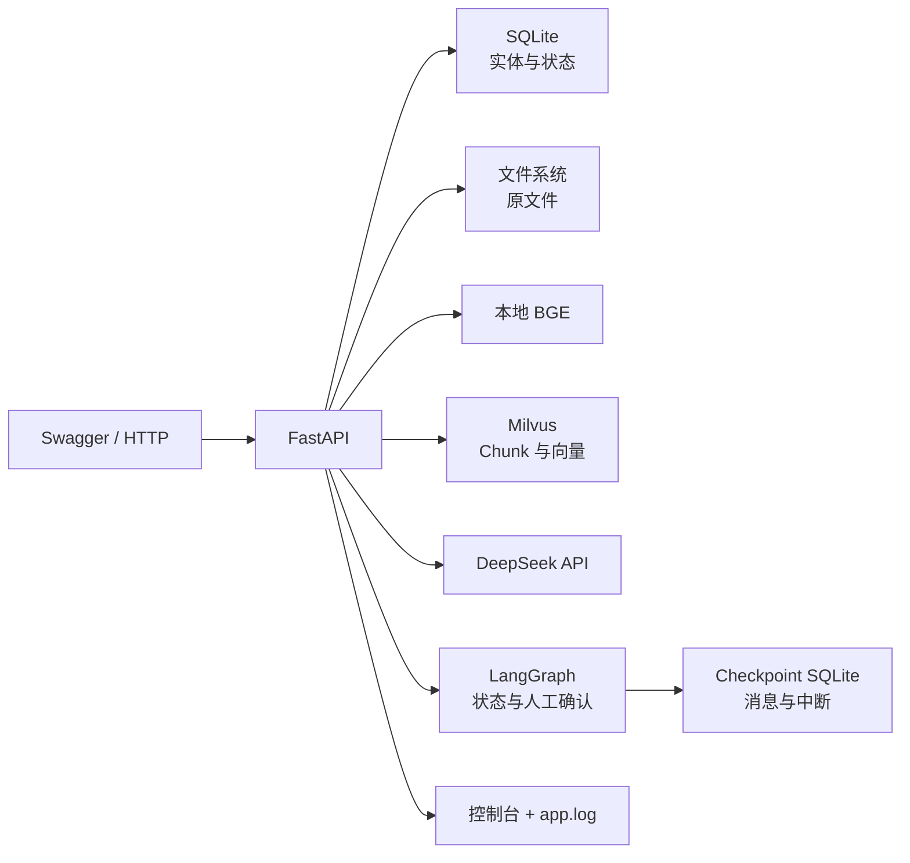
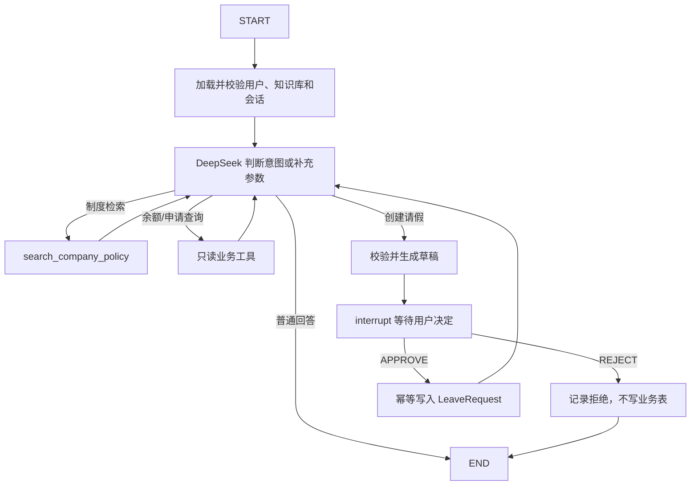

# Mini RAG 技术架构

## 架构目标

以模块化单体实现可解释的 RAG 与企业行政 Agent 链路。保持单进程和同步 FastAPI/SQLModel，不为了展示框架而增加空转层。

## 系统边界



## 分层

| 层 | 目录 | 职责 |
| --- | --- | --- |
| HTTP | `app/routers` | 路由、状态码、请求/响应转换 |
| 依赖 | `app/dependencies` | Session、模拟身份、资源归属 |
| 契约 | `app/schemas` | Pydantic API Schema |
| 应用与领域 | `app/services` | 用例、领域规则、事务、文件、模型和客户端 |
| Agent 编排 | `app/agents` | State、Prompt、Tool、Graph、暂停恢复和观测 |
| 持久化 | `app/models` | SQLModel 表与枚举 |
| 基础设施 | `app/core`, `app/db.py` | 配置、日志、异常、Engine |

实际调用链为 `Router → Application Service → Agent / Domain Service → SQLModel 或外部 Client`。当前不增加通用 Repository 层；领域 Service 直接使用明确注入的 SQLModel Session 管理查询和事务。

## Agent 模块边界

```text
Agent Router
→ Agent Application Service
→ LangGraph Runtime
→ State / Prompt / Tool / Graph
→ Leave Service / Retrieval Service
→ 业务 SQLite / Milvus / DeepSeek
```

- Router 只处理 HTTP 契约、依赖注入和状态码。
- Agent Application Service 负责会话所有权、Graph invoke/resume 和响应转换。
- Graph 只保存可序列化状态，不保存 Session、Engine 或客户端。
- Tool 只声明模型可见参数，并调用领域 Service；身份和知识库范围由运行上下文注入。
- Leave Service 负责工作日、余额、重复申请、事务和幂等规则。
- RAG Prompt/Context Builder 负责上下文和引用，不再以 `rag_agent` 命名为自主 Agent。

## 请求流程

```text
HTTP → request_id 中间件 → 参数校验 → Session/身份依赖
→ 资源所有权依赖 → Router → Service → Response Schema → X-Request-ID
```

## 文档入库

```text
保存原文件并计算 SHA-256 → 创建 UPLOADED
→ 标记 PROCESSING → 删除旧 Chunk → 按类型解析页面
→ 逐页切分并保留 page/start_index/chunk_index → 生成 chunk_id
→ BGE 批量生成 512 维归一化向量 → 写入 Milvus
→ 标记 READY 并保存 chunk_count
```

解析同步执行；失败时回写 `FAILED` 和安全错误摘要。

## 检索与问答

```text
验证用户和资源归属 → 问题 Embedding
→ Milvus 按 user_id + kb_id 过滤并取 Top-K
→ 阈值过滤 → 降序 Top-N
→ 无结果：直接拒答、保存历史、不调用 DeepSeek
→ 有结果：编号 S1..Sn + 最近 20 条历史 → DeepSeek
→ 同一事务保存问题、回答、引用 → 返回 answer/rejected/sources
```

## 存储边界与一致性

- SQLite 是业务事实来源；文件系统保存可重新解析的原文件；Milvus 是可重建检索索引。
- `document_id` 关联三处数据，`user_id + kb_id` 用于授权和检索过滤。
- 没有跨三种存储的分布式事务，通过状态机与幂等重试补偿。
- 业务 SQLite 保存员工、余额、申请、Agent 会话和工具审计，是业务事实来源。
- 独立 Checkpoint SQLite 由 LangGraph 管理，只保存执行快照、消息和待确认中断；不能替代业务表。

## Agent 状态图



暂停前只能进行无副作用校验和草稿生成。恢复后可能重新执行节点，因此数据库写入必须依赖唯一幂等键。

## 异常、日志与测试

- `AppError` 返回安全业务错误；校验错误包含结构化详情；未知异常只在日志保留堆栈。
- 日志写控制台和轮转文件，记录请求/资源 ID、耗时、候选分数和拒答原因，不记录密钥和完整正文。
- 服务测试覆盖算法和状态；路由测试使用内存 SQLite；外部系统使用 Mock；真实链路由 Swagger 人工验收。

## 风险与取舍

- 同步解析/推理可能占用请求线程。
- SQLite、文件、Milvus 中途崩溃时可能不一致。
- `X-User-ID` 可伪造，只适合当前学习和可信朋友小范围使用；在扩大访问范围前必须替换为完整认证。
- 正式启动使用 Alembic；`create_all()` 只保留给隔离测试快速建表。
- Agent 原型尚未接入 API、Checkpoint 和业务表，不能视为已实现能力。
- 普通 PDF 解析不支持 OCR/复杂表格。
- DeepSeek 未显式配置超时和重试。

## 待确认

1. `[ASK USER]` 是否继续同步解析，还是后续引入后台任务？该问题不阻塞当前 Agent 迭代。

## 已确认演进方向

- 继续保持个人学习、小范围使用定位，不建设公开多租户平台。
- 显示名称允许重复；未来以唯一邮箱和密码登录，密码只保存安全哈希，并使用 JWT Bearer Token 访问受保护接口。
- JWT 上线后，身份依赖从校验 `X-User-ID` 改为验证 Token 并读取其中的用户标识。
- 登录成功后签发短期 Access Token 和较长期 Refresh Token；受保护接口只接收 Access Token，刷新流程只接收 Refresh Token。
- SQLite 保存 Refresh Token 的单向哈希、过期时间和撤销状态。刷新前查询有效会话，退出登录将对应会话标记为撤销。
- 为控制学习项目复杂度，刷新时只签发新的 Access Token，不轮换 Refresh Token；原 Refresh Token 可使用到过期或撤销。

未来认证链路：

```text
邮箱 + 密码 → 校验密码哈希 → 签发 Access/Refresh Token
→ 保存 Refresh Token 哈希和登录会话 → Access Token 访问业务接口
→ Refresh Token 查询未撤销、未过期会话 → 只签发新的 Access Token
→ 退出登录 → 撤销对应登录会话
```
- 当前不增加角色系统。
- Agent 采用单状态图，不增加主管 Agent 或子 Agent。
- Agent API 与现有 RAG Chat API 并存，不改变现有 Chat 契约。
- 已建立 Alembic RAG Schema 基线；新增 Agent 业务表使用后续迁移，Checkpoint 使用独立 SQLite 文件。
- 写工具使用人工确认；只读工具不暂停。
- 后续只增加知识库修改、删除能力，不增加用户资料修改或账号删除。
- 知识库只允许在不存在文档和聊天会话时删除，不自动级联清理关联数据。

## 证据

- `app/main.py`、`app/dependencies/`
- `app/services/document_service.py::process_document`
- `app/services/retrieval_service.py::retrieve_chunks`
- `app/services/chat_service.py::ask_question`
- `app/core/errors.py`、`app/core/logging.py`
