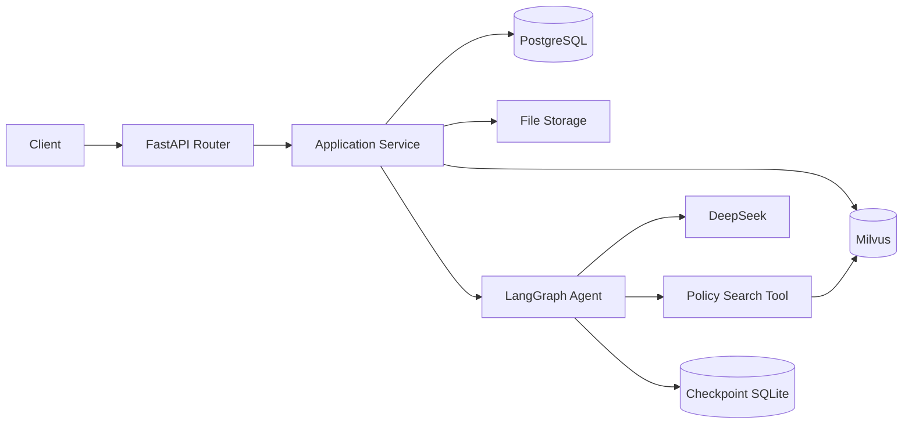
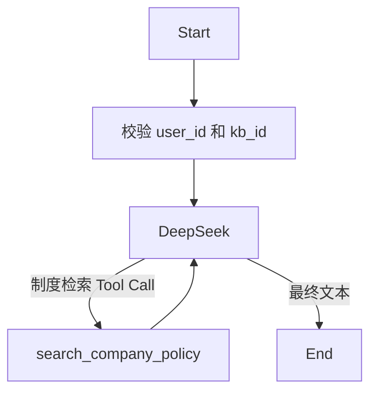

# 技术架构

## 架构目标

系统采用同步 FastAPI + SQLModel 的模块化单体。PostgreSQL 保存业务事实，
Milvus 保存可重建向量索引，文件系统保存原文件，SQLite 仅用于 LangGraph
Checkpoint。当前不引入微服务、Repository 抽象或多 Agent。

## 模块与职责

| 模块 | 位置 | 职责 |
|---|---|---|
| 协议层 | `app/routers`, `app/schemas` | HTTP 输入输出、状态码与契约 |
| 应用服务 | `app/services` | 所有权、流程、事务和响应转换 |
| 数据实体 | `app/models` | PostgreSQL 业务表映射 |
| Agent | `app/agents/admin` | State、Prompt、Graph、Runtime、观测 |
| Agent Tool | `app/agents/tools` | 绑定授权范围的制度检索 |
| 数据库 | `app/db.py`, `migrations` | Engine、Session 与 Alembic |
| 外部依赖 | embedding/vector/model/file services | 模型、Milvus 与文件系统访问 |

调用链为 `Router → Application Service → Domain/Agent → SQLModel 或 Client`。
Router 不直接处理业务事务；外部系统访问不写入 Graph State。

## Agent 调用关系

Agent 是只读单图。模型只能看到 `query`；`user_id` 和 `kb_id` 由服务端从
已授权会话注入。Graph 消息和范围由 Checkpoint SQLite 跨请求恢复。

## 数据流

文档链路：上传原文件 → PostgreSQL `documents` → 解析切分 → Embedding →
Milvus Chunk → 更新 PostgreSQL 状态与数量。

问答链路：验证会话所有权 → 检索当前用户/知识库 → 阈值过滤 → 有依据才
调用 DeepSeek → 在 PostgreSQL 保存问答和引用。

Agent 链路：验证 Agent 会话所有权 → 从 PostgreSQL 取得绑定范围 → 调用
LangGraph → Tool 检索 Milvus → 返回引用 → PostgreSQL 保存脱敏工具审计。

## 外部依赖

- PostgreSQL 16：业务事实与 Alembic Schema。
- Milvus 2.6：Chunk 向量与标量字段。
- etcd/MinIO：Milvus 依赖。
- 本地 BGE：Embedding。
- DeepSeek OpenAI 兼容 API：回答与 Tool Calling。
- SQLite：仅 LangGraph Checkpoint，不属于业务数据库。

## 异常、事务与一致性

- 单个 PostgreSQL 业务动作由一个 SQLModel Session 提交，失败时回滚。
- PostgreSQL、Milvus、文件系统不能组成分布式事务，使用文档状态和幂等
  删除支持补偿与重试。
- Agent 工具错误转换为稳定消息；内部异常不进入 API 和审计正文。
- Checkpoint 与业务表不建外键，删除 Agent 会话时需显式清理状态。

## 日志与监控

HTTP 响应携带请求 ID；关键链路写控制台与轮转日志。`/health` 分别检查
PostgreSQL、Milvus 和 Embedding。工具日志只保存参数/结果摘要、耗时和错误码。

## 测试方案

- Service、Router、Graph 单元测试可使用隔离 SQLite 以保证速度。
- Alembic 保留快速方言无关测试，并增加显式 PostgreSQL 专用测试。
- Compose 验证使用真实 PostgreSQL；SQLite 测试不能替代此证据。
- DeepSeek 与 Milvus 的真实质量通过独立评测运行，不混入普通单元测试。

## 已知风险

- 当前 `X-User-ID` 可伪造，不适合作为生产认证。
- Checkpoint 仍是单机 SQLite，不支持多副本并发部署。
- 同步解析可能阻塞请求；大文件需后续任务队列。
- 标书业务模型、解析质量指标和合规规则尚未设计。
