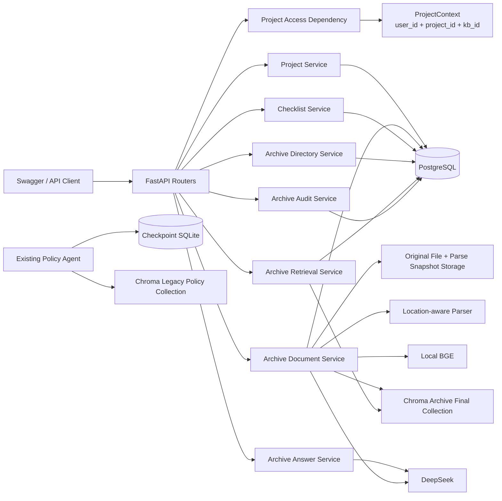
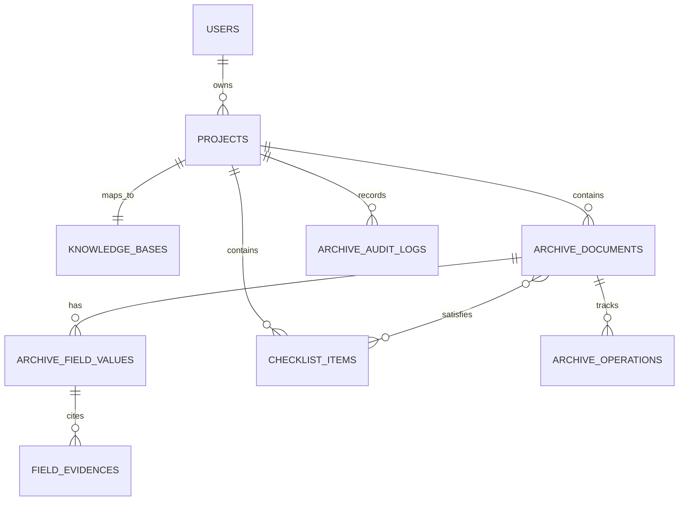
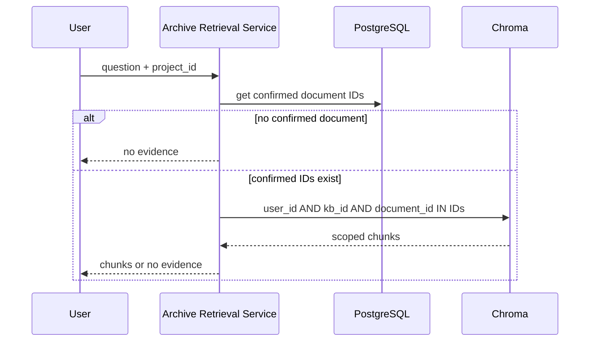
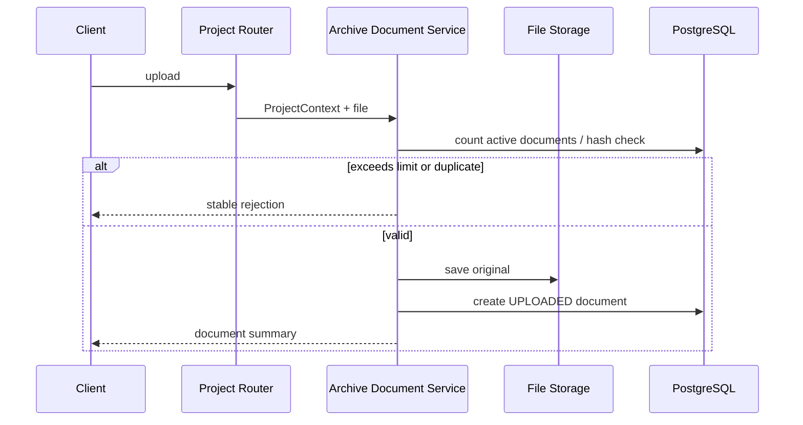
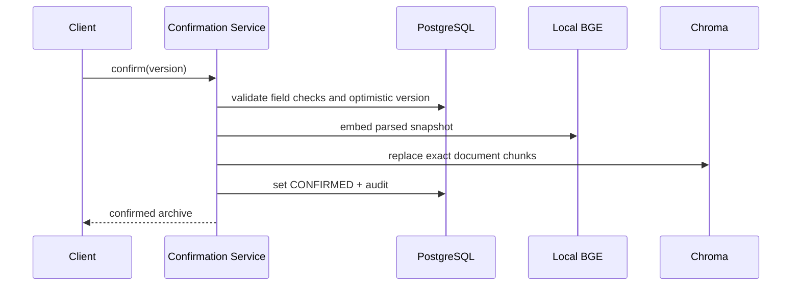
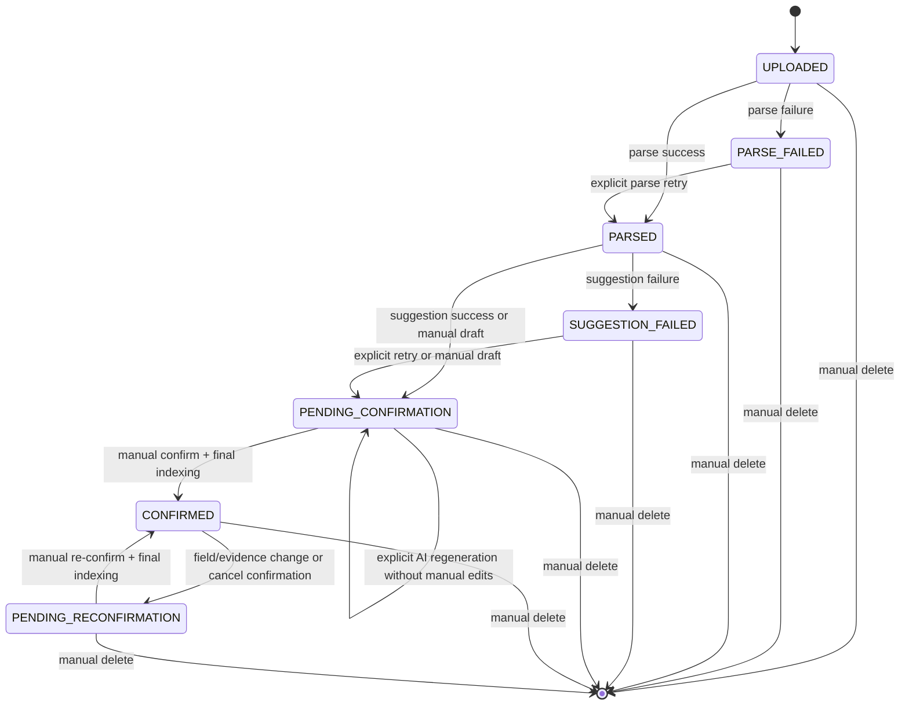

# 智慧档案与企业文档智能 V1 技术架构

## 1. 文档信息

| 项目 | 内容 |
|---|---|
| 对应需求 | `docs/requirements.md` 的 FR-030～FR-041、BR-008～BR-029、NFR-011～NFR-020 |
| 文档状态 | 架构、数据库与 API 设计基线已确认；Chroma 代码/部署配置迁移已完成本地验证，完整云端应用栈验证待执行；已完成 AV1-P01～P03、P04 前置模型分层及 FR-030 项目 CRUD/模板复制 API，清单项与归档业务 API 尚未实现 |
| 更新日期 | 2026-08-07 |
| 当前业务方向 | 智慧档案与企业文档智能 |
| 架构风格 | 同步 FastAPI 模块化单体 |

本文件描述智慧档案 V1 的目标架构。当前代码已实现项目 CRUD、项目专属知识库范围与
可选的五项虚构模板复制；它不表示清单项管理、档案字段、人工确认或正式档案检索已经实现。

当前项目仍保留企业知识库检索 Agent 基座。旧的制度检索 Agent 与其 SQLite
Checkpoint 不是智慧档案 V1 的业务状态来源，也不应被误写为已完成的档案能力。

向量存储已由 Milvus 改为 Chroma 单机服务模式，详见
`docs/chroma-migration-decision.md`。`vector_service`、检索、删除、健康检查和 Compose 已完成
本地代码/单测迁移；完整云端应用栈验证、向量重建与阈值标定仍未完成。

## 2. 架构目标与关键决策

### 2.1 目标

架构需要支持以下业务闭环：

```text
项目隔离
→ 上传原文件
→ 解析并保存可追溯文本快照
→ AI 建议或人工录入字段
→ 人工确认正式归档
→ 确认档案与清单项关联
→ 正式目录、缺失提示与带证据问答
```

### 2.2 核心架构决策

1. 采用模块化单体，不引入微服务、Repository 层、多 Agent 或任务队列。
2. 逻辑上的“工程项目”拥有一个唯一知识库范围；客户端以项目为业务入口，
   服务端将其解析为受控的 `ProjectContext`。
3. PostgreSQL 中的档案确认状态是正式范围的唯一事实来源。Chroma 不单独决定
   哪些文档可以被正式检索。
4. 未确认文档不写入正式检索 Collection；正式问答还必须从 PostgreSQL 获取
   `CONFIRMED` 文档集合，再构造 Chroma 的文档范围过滤，形成双重可见性闸门。
5. 解析、AI 建议、确认和删除是显式 API 动作。同步链路保持可观察、可重试。
6. 档案字段、字段证据、清单关联和业务审计保存为 PostgreSQL 业务事实；
   LangGraph Checkpoint 只保留给旧 Agent。
7. 智慧档案问答使用直接的“受控检索 → Grounded Prompt → 回答”服务，不为单一
   检索动作额外引入 Tool Calling Agent。

第 4 项专门防止“文档处理列表”和“正式档案目录”共用底层数据时，待确认文档
被误曝到正式查询或问答。

## 3. 现有基础、改造边界与缺口

### 3.1 可复用基础

| 现有模块 | 当前职责 | 智慧档案中的处理方式 |
|---|---|---|
| `app/dependencies/auth.py` | 验证 `X-User-ID` | 继续复用 |
| `app/dependencies/resources.py` | 知识库、文档、会话所有权 | 扩展为项目上下文和项目资源校验 |
| `app/services/file_service.py` | 保存、删除原文件和哈希 | 继续复用并增加 20 MB、100 份上限校验入口 |
| `app/services/parser_service.py` | PDF/DOCX/TXT/MD 文本提取 | 改造为位置感知解析快照 |
| `app/services/chunk_service.py` | 分块与稳定 Chunk ID | 继续复用，仅在正式确认后写入正式 Collection |
| `app/services/embedding_service.py` | 本地 BGE Embedding | 继续复用 |
| `app/services/vector_service.py` | Chroma HTTP 连接、写入、删除 | 后续扩展正式档案 Final Collection、可见性闸门与项目范围过滤 |
| `app/services/retrieval_service.py` | 用户/知识库范围检索 | 扩展“已确认 document_id 集合”过滤 |
| `app/services/model_service.py` | DeepSeek 调用 | 分别服务于建议与 Grounded 问答 |
| `app/core/errors.py`、日志 | 稳定错误和服务端日志 | 继续复用 |
| Alembic/PostgreSQL | 业务迁移与事实存储 | 新增档案领域迁移 |

### 3.2 必须改造

| 当前行为 | 为什么不足 | 目标改造 |
|---|---|---|
| `DocumentStatus` 使用 `PROCESSING/READY/FAILED` | 无法表达建议、人工检查、确认和重新确认 | 以需求中的七个用户可见状态替换，并分离内部操作状态 |
| `process_document()` 当前解析后立即 Embedding 并写入旧 Milvus | `READY` 文档会参与现有检索，违反未确认不可问答 | 解析只生成文本快照；确认时才建立正式 Chroma 检索索引 |
| DOCX 被拼成一个逻辑页 | 无法提供稳定段落证据 | 生成段落序号、摘录和规范化定位辅助信息 |
| TXT/MD 使用逻辑页 1 | 无法提供行号范围 | 生成从 1 开始的行号范围 |
| 检索只过滤 `user_id + kb_id` | 未确认或孤立向量可能被检索 | 再过滤 PostgreSQL 已确认 `document_id` 集合 |
| `GET /documents` 直接返回全部文档 | 易与正式档案目录混淆 | 分离处理列表查询服务和正式目录查询服务 |

### 3.3 新增领域能力

- 项目与知识库的一对一业务映射。
- 档案字段、字段状态、来源、证据和修改摘要。
- 解析快照、`file_hash`、`snapshot_hash` 与解析器版本。
- 演示清单、档案—清单项确认关联和缺失计算。
- 正式目录查询、档案详情、正式问答。
- 领域审计、并发版本和内部操作记录。

### 3.4 不适合照搬

- `search_company_policy`：语义绑定公司制度，不适合项目档案问答。
- LangGraph Checkpoint：只保存旧 Agent 运行状态，不能保存档案确认、字段或清单。
- 已删除的请假领域、人工决定接口和写工具：不能改名后复用。
- 当前“解析即入旧 Milvus”的文档链路：不能作为正式档案索引的可见性规则。

### 3.5 当前验证边界

- 已有自动测试、离线迁移 SQL 和有限真实检索记录只证明旧知识库/制度检索基座的
  部分行为，不能替代智慧档案 V1 的实现与质量验收。
- 真实 PostgreSQL 空库迁移、完整 Docker Compose 启动和健康检查仍需在可用运行环境
  中复验。
- 持久化的 BGE 模型路径仍需在实际配置修改后复验；在完成前不得宣称新架构已可
  通过默认配置端到端运行。

## 4. 分层与目标模块

调用方向保持不变：

```text
Router → Project Access / Application Service → Domain Service
→ PostgreSQL、文件系统、Chroma、DeepSeek
```

Router 不直接提交业务事务、查询 Chroma 或调用模型。Domain/Service 不返回
FastAPI 响应对象。Graph State 不保存数据库 Session、模型客户端或向量客户端。

以下目录说明职责边界。模型四模块、`ProjectContext`、`projects.py`、`project_service.py`
和 `schemas/project.py` 已创建；其余 Router、Service 和 Schema 文件仍是后续实施目标：

```text
app/
├── routers/
│   ├── projects.py                 # 项目、处理列表、正式目录
│   ├── archive_documents.py        # 上传、解析、建议、字段草稿、确认、删除
│   ├── checklists.py               # 清单及档案关联
│   ├── archive_retrieval.py        # 正式检索与问答
│   └── archive_audit.py            # 脱敏审计查询
├── dependencies/
│   └── project_context.py          # ProjectContext 与所有权校验
├── services/
│   ├── project_service.py
│   ├── archive_document_service.py
│   ├── archive_parse_service.py
│   ├── archive_suggestion_service.py
│   ├── archive_confirmation_service.py
│   ├── checklist_service.py
│   ├── archive_directory_service.py
│   ├── archive_retrieval_service.py
│   ├── archive_answer_service.py
│   ├── archive_audit_service.py
│   └── archive_operation_service.py
├── models/
│   ├── project.py
│   ├── archive.py
│   ├── checklist.py
│   └── archive_audit.py
└── schemas/
    ├── project.py
    ├── archive.py
    ├── checklist.py
    └── archive_audit.py
```

现有通用的文件、解析、切分、Embedding、模型、向量和错误服务继续保留。不得仅为
模仿其他项目新增空转 Repository 层。

## 5. 总体组件图



新业务不依赖 `LegacyAgent` 或 `Checkpoint SQLite`。二者在图中保留是为了
说明当前基座仍存在，而不是智慧档案 V1 的实现依赖。

## 6. 项目访问与授权边界

### 6.1 ProjectContext

每个项目级请求先执行以下动作：

```text
X-User-ID
→ 查询真实 User
→ 查询 Project
→ 校验 Project.owner_id == current_user.id
→ 获取 Project 对应 kb_id
→ 注入不可由客户端覆盖的 ProjectContext
```

`ProjectContext` 是内部不可变 dataclass，至少包含：

| 字段 | 用途 |
|---|---|
| `user_id` | PostgreSQL 所有权与 Chroma 元数据过滤 |
| `project_id` | 项目、清单、字段、审计和目录范围 |
| `kb_id` | 复用现有文件、Chunk 与 Chroma 数据隔离范围 |

客户端不提交 `owner_id`、`user_id` 或可替换的 `kb_id`。模型也不能生成这些值。

### 6.2 资源校验

- 项目接口：验证项目所有权。
- 文档、档案字段、清单项、关联和审计接口：先验证项目，再验证资源属于该项目。
- 删除文档与 Chroma 清理：必须带 `user_id + kb_id + document_id`。
- 正式问答：服务端从 `ProjectContext` 注入用户、项目和知识库范围。

## 7. 逻辑数据边界

本节只定义逻辑对象和归属，不定义物理列、索引或迁移细节；后者属于
`docs/database-design.md`。



### 7.1 Project

Project 是智慧档案的业务入口，拥有项目名称、项目说明、所有者和一个唯一
`kb_id`。项目与现有 `KnowledgeBase` 的物理映射方案由数据库设计决定：

- 可新增 `projects` 并对 `kb_id` 建立唯一一对一映射；
- 或在满足迁移和通用知识库兼容性的前提下扩展现有实体。

无论选哪种物理方案，业务 API 和 `ProjectContext` 都只暴露项目语义。

### 7.2 ArchiveDocument 聚合

ArchiveDocument 以现有 Document 为原文件身份基础，逻辑上包含：

- 原文件元数据、`file_hash`、存储路径和用户可见文档状态；
- 解析快照元数据；
- 七个字段及独立检查状态；
- 字段证据和人工来源标记；
- 确认人、确认时间、修改摘要和并发版本；
- 正式检索索引状态与内部操作记录。

档案目录不创建第二份“正式文档”副本；它是 `CONFIRMED` ArchiveDocument 的
专用查询视图。

### 7.3 ParsedSnapshot

解析成功后保存派生快照，而不是立即写入正式 Chroma：

| 内容 | 用途 |
|---|---|
| `file_hash` | 原始上传文件字节的 SHA-256；只用于当前项目内的重复上传校验 |
| `snapshot_hash` | 位置感知解析快照的规范化内容与定位信息的 SHA-256；用于确认字段证据所依赖的快照未变化 |
| 解析器版本 | 解释定位生成规则 |
| 位置感知片段 | AI 建议、字段证据和确认时 Embedding |
| 摘录辅助定位 | DOCX 段落变化后的人工核验 |

`file_hash` 不用于判断快照内容或证据定位是否变化，`snapshot_hash` 也不参与上传
去重。原文件仍保存在文件系统；快照是可删除、可重新生成的派生文件。删除文档时，
原文件和快照一并删除。`snapshot_hash` 的规范化序列化格式和数据库字段细节在后续
数据库设计中固定。

### 7.4 FieldValue 与 FieldEvidence

每个正式字段独立保存：

- 值或空值；
- 检查状态；
- 来源（AI 或人工）；
- 无原文证据标记；
- 修改人、时间和可选原因。

证据保存当前文档的摘录、定位类型、定位值和必要的规范化辅助文本。AI 非空字段
必须至少关联一条证据；人工字段可以证据为空。

### 7.5 ChecklistItem 与 ChecklistLink

ChecklistItem 保存名称、资料类型、必需属性、阶段和说明。ChecklistLink 是
ArchiveDocument 与 ChecklistItem 的多对多关系，单独保存确认状态、确认人、
确认时间与并发版本。

清单项“满足”不是一个可由类型自动推导的持久化事实，而是：

```text
document.status == CONFIRMED
AND checklist_link.status == CONFIRMED
```

缺失/未提供是查询时根据上述条件计算的派生结果。

### 7.6 ArchiveAuditLog 与 ArchiveOperation

- ArchiveAuditLog 保存用户可查询的脱敏业务操作。
- ArchiveOperation 保存内部解析、索引或删除操作状态，用于恢复、避免重复和
  观察跨存储失败。

ArchiveOperation 不属于七种用户可见文档状态，正常文档处理列表不直接展示它。
成功删除后不保留 Document；只保留脱敏删除审计。

内部操作至少区分 `operation_type`（`PARSE`、`SUGGEST`、`INDEX`、`DELETE`）和
`operation_status`（`RUNNING`、`SUCCEEDED`、`FAILED`）。删除操作还必须带
`visibility_blocking = true`，使其在物理清理完成前就阻断正式目录、检索与问答。
具体字段类型、唯一约束和恢复记录由数据库设计固定。

## 8. 文件、解析与证据架构

### 8.1 解析适配器

解析器统一输出 `ParsedFragment`，而不是仅输出“页码 + 全文”：

| 文件 | 主定位 | 辅助信息 |
|---|---|---|
| PDF | 页码（从 1 开始） | 页内摘录、字符起点 |
| DOCX | 段落序号（从 1 开始） | 段落规范化文本前 50 字、摘录 |
| TXT / MD | 行号范围（从 1 开始） | 摘录、字符范围 |

DOCX 段落序号可能因重新编辑文档发生偏移，因此架构要求同时保存规范化文本辅助
定位，不能只靠序号人工核验。

### 8.2 有效文本判定

Parser 在解析层把“无可提取文字”标准化为业务错误。AV1-P01 已冻结：TXT/MD 使用
`utf-8-sig`，CRLF/CR 统一为 LF、连续空白压缩为一个空格；归一化有效文本最小 20、
最大 1,000,000 字符。PDF 无可提取文本才归类为扫描件；存在少量文字但低于阈值时归类为
有效文本不足。完整定位、快照序列化和 DOCX 逻辑块规则见
`docs/archive-v1-parser-design.md`。

扫描 PDF 解析失败时：

```text
PARSE_FAILED
→ 稳定错误码
→ “暂不支持扫描件，请上传文本版资料”
```

### 8.3 AI 输入最小化

ArchiveSuggestionService 只接收当前文档的 ParsedSnapshot。它向模型发送用于分类、
字段建议和证据定位的必要片段，不发送其他项目文档、项目审计、用户身份或密钥。

ArchiveAnswerService 只接收当前项目、当前正式文档的检索结果。它的 Prompt 要求：

- 仅依据提供的原文片段回答；
- 没有依据时拒答；
- 不将人工无证据字段转述为原文事实；
- 返回可映射到检索 Chunk 的引用标识。

## 9. 正式可见性与索引架构

### 9.1 为什么不让解析阶段直接正式入库

AI 建议需要已解析文本，但正式检索只允许人工确认档案。如果在 `PARSED` 阶段
把 Chunk 写入正式 Collection，仅靠调用方“记得加状态过滤”容易泄露待确认资料。

因此采用以下策略：

```text
上传 → 原文件
解析 → ParsedSnapshot
建议/手工编辑 → PostgreSQL 草稿
人工确认 → Embedding + 写入 Final Collection + PostgreSQL CONFIRMED
```

未确认文档不进入 Final Collection。

### 9.2 双重检索闸门

正式问答和检索必须同时满足：

1. PostgreSQL 查询 `status = CONFIRMED` 且不存在可见性阻断操作的当前项目文档 ID；
2. Chroma 使用 `where` 过滤 `user_id + kb_id + document_id in confirmed_document_ids`。



这不仅隔离用户和项目，也防止“Chroma 已写入但 PostgreSQL 确认事务未完成”的孤立
向量被正式检索。

### 9.3 Final Collection

智慧档案使用独立的正式 Collection，例如由新配置项指定为
`archive_final_chunks`；不得直接修改或复用现有制度检索使用的
`mini_rag_handwrite_chunks` Collection。每个智慧档案项目在该独立 Collection 中
仍采用单 Collection + 标量过滤模式，至少包含：

- `user_id`、`kb_id`、`document_id`；
- `chunk_id`、原文件名、内容、向量；
- 位置类型、位置起止值、摘录或其生成所需元数据；
- `snapshot_hash` 和解析器版本。

Collection 的完整字段、索引和迁移策略由数据库/向量设计阶段确定。禁止依赖
Chroma 的元数据过滤或模型生成的身份字段绕过 ProjectContext。

## 10. 主要调用流程

### 10.1 上传



文件大小、项目数量、文件类型和重复检查必须在保存前完成。文件保存后数据库失败时，
服务执行补偿清理并记录服务器日志。

### 10.2 解析与建议

```text
UPLOADED
→ parse action
→ ParsedSnapshot + PARSED
→ suggestion action
→ PENDING_CONFIRMATION
```

- 解析失败：`PARSE_FAILED`，用户通过明确重试动作再次解析。
- DeepSeek 失败：`SUGGESTION_FAILED`，保留解析快照；用户可重试建议或转手工。
- `PENDING_CONFIRMATION` 草稿若七个字段均待检查且没有人工字段或人工证据修改，用户可
  显式重新生成建议。服务完成新草稿校验后才原子替换旧 AI 草稿；存在人工编辑时拒绝，模型
  失败时保留旧草稿和当前状态。
- 普通解析、解析重试、建议重试和建议重新生成是不同应用服务入口，避免隐式覆盖与重复写入。

### 10.3 人工确认、重新确认与索引



确认前检查标题、类型、七个字段检查状态和证据规则。确认成功后文档才进入正式
目录与问答范围。

如果 Chroma 写入成功但 PostgreSQL 提交失败，双重检索闸门会阻止孤立向量被检索。
后续明确重试会按 `user_id + kb_id + document_id` 清理并重建该文档 Chunk。

修改任一正式字段或字段证据时，先在 PostgreSQL 中写入待重新确认状态和审计，
使正式目录与 confirmed ID 查询立即排除该文档；随后清理 Final Chunk：

```text
CONFIRMED
→ PENDING_RECONFIRMATION
→ delete final chunks
→ re-confirm
→ CONFIRMED
```

删除 Chunk 失败时，文档仍处于待重新确认状态，因此不会被正式查询或问答使用。
ArchiveOperation 必须记录失败并支持后续恢复。

### 10.4 两个列表的强制边界

| 查询 | 专用服务 | PostgreSQL 条件 | 返回范围 |
|---|---|---|---|
| 文档处理列表 | ArchiveDocumentService | 项目内所有未删除文档 | 上传、失败、待确认、已确认、待重新确认 |
| 正式档案目录 | ArchiveDirectoryService | 项目内 `status = CONFIRMED` 且无可见性阻断操作 | 仅正式档案与正式字段 |

禁止由同一个“通用文档列表”加可选 `include_pending` 参数同时承载两个语义。
API、Service 和集成测试都必须保留这条分界。

### 10.5 清单与缺失

```text
ChecklistItem
→ suggestion by type/stage
→ user confirms ChecklistLink
→ calculate missing from confirmed document + confirmed link
```

清单名称、资料类型或阶段变动时，ChecklistService 使受影响关联失效并重新计算。
仅修改说明不会使关联失效。清单缺失计算只访问 PostgreSQL，不调用 DeepSeek。

### 10.6 删除

```text
authorize project/document
→ create visibility-blocking delete operation
→ hide from formal query
→ delete final chunks
→ delete original and parse snapshot
→ delete field/evidence/link/business records
→ recompute checklist
→ write redacted audit
```

PostgreSQL、文件系统和 Chroma 不存在分布式事务。ArchiveOperation 记录每一步，
用于安全重试与补偿；成功后物理删除业务记录，不保留可恢复副本。

若外部清理失败，文档继续受未完成的 `DELETE` 操作阻断。用户再次调用同一删除动作时
恢复该未完成操作，不创建并行删除操作或重复的成功删除审计。

## 11. 文档状态与内部操作状态

### 11.1 用户可见状态机



用户可见状态不包含 `DELETING`、`DELETE_FAILED`、索引尝试次数或内部异常堆栈。
删除是用户手动触发的操作，不是自动状态流转；任一稳定用户可见状态均可发起删除。
若解析、建议、确认或删除操作正在运行，新的删除请求返回操作冲突。删除操作在外部
清理前即作为可见性阻断操作，使目录与检索保守排除该文档；这些内部状态由
ArchiveOperation 和受控日志保存。

### 11.2 内部操作状态

解析、建议、索引和删除各有独立操作记录，使用 `operation_type` 区分操作种类，
使用 `operation_status`（例如 `RUNNING`、`SUCCEEDED`、`FAILED`）表达执行结果。
`DELETE + RUNNING` 必须设置 `visibility_blocking = true`。它们用于：

- 防止同一文档并发执行相同操作；
- 记录一次手动重试；
- 在跨存储部分成功时支持补偿；
- 不把内部状态泄露给普通列表。

具体枚举与锁策略属于数据库设计和 API 设计，不在本文件固定。

## 12. 事务、一致性、重试与并发

### 12.1 一致性表

| 动作 | PostgreSQL | 文件系统 | Chroma | 失败处理 |
|---|---|---|---|---|
| 上传 | 创建 UPLOADED 身份 | 保存原文件 | 无 | DB 失败补偿删除文件 |
| 解析 | 更新状态、快照元数据 | 保存快照 | 无 | 保留失败摘要，允许手动重试 |
| 建议 | 保存字段草稿/证据 | 读取快照 | 无 | 保留快照，转建议失败或手工 |
| 确认 | 验证后写 CONFIRMED/审计 | 读取快照 | 写 Final Chunk | 写入失败不确认；孤立 Chunk 被 PG 闸门排除 |
| 修改正式字段 | 转待重新确认 | 保留快照 | 删除 Final Chunk | 删除失败由 Operation 记录，保守排除 |
| 删除 | 最终物理删除和审计 | 删除原文件/快照 | 精确删除 Chunk | 不虚假成功，记录可恢复操作 |

### 12.2 重试

- 连接失败和超时仅自动重试一次。
- 参数、权限、状态、解析、模型结构和业务冲突不自动重试。
- 解析和建议的手动重试使用明确 API，并写一次操作审计。
- 网络层自动重试不得造成重复 Chunk、重复档案或重复成功审计。

### 12.3 并发与幂等

- 字段草稿、确认和清单更新携带版本号或更新时间。
- 服务在事务中检查版本，旧版本提交返回稳定冲突。
- 同一内容的重复确认保持幂等。
- 上传在当前项目内以 `file_hash` 唯一约束/事务校验防止竞争窗口。
- Parse、suggest、confirm 和 delete 均由 ArchiveOperation 防止并行运行。

## 13. DeepSeek、BGE 与旧 Agent 的边界

| 组件 | 智慧档案 V1 职责 | 不承担的职责 |
|---|---|---|
| 本地 BGE | 只为确认后的正式 Chunk 和用户问题生成向量 | 不判断档案是否齐全 |
| DeepSeek 建议 | 分类、字段、证据草稿 | 不确认正式字段，不决定清单满足 |
| DeepSeek 问答 | 仅依据正式检索 Chunk 回答或拒答 | 不引用人工无证据字段，不跨项目检索 |
| ChecklistService | 依据人工确认关联计算缺失 | 不调用模型推断缺失 |
| 旧 LangGraph Agent | 保持现有制度检索基座 | 不保存或驱动新档案状态 |

DeepSeek 未配置或关闭时，ArchiveSuggestionService 和 ArchiveAnswerService 返回稳定
不可用结果；解析、手工填写、确认、正式目录、清单和重复校验继续可用。

## 14. 安全、日志与审计

### 14.1 数据安全

- 第一版仅使用虚构或脱敏资料。
- Swagger、README 必须提示相关文档片段可能发送给外部 DeepSeek。
- 不保存或返回 Token、密码、模型隐藏推理、完整 Prompt 或完整审计正文。
- 所有 Chroma 检索和删除均使用服务端注入的范围。Compose 内 API 通过内部 `chroma:8000` 访问；
  本地开发允许回环映射 `127.0.0.1:8001` 供宿主机 Python 调试，目标云部署不发布 Chroma 宿主机端口。

### 14.2 日志与审计分工

| 类型 | 内容 | 可由用户查询 |
|---|---|---|
| 服务端日志 | 受控错误上下文、耗时、请求 ID、操作 ID | 否 |
| ArchiveOperation | 内部执行状态、可恢复失败摘要 | 否，除非后续设计专门暴露 |
| ArchiveAuditLog | 操作类型、操作人、时间、资源标识、脱敏摘要 | 是，仅本人项目 |

正常查询、列表和普通证据问答不写业务审计。

## 15. 质量与测试架构

### 15.1 测试分层

| 层级 | 核心覆盖 |
|---|---|
| Domain/Service 单元测试 | 状态流转、字段检查、清单满足、缺失、版本冲突、审计去重 |
| PostgreSQL 集成测试 | 项目映射、唯一名称、外键/约束、迁移、正式目录 SQL 条件 |
| 文件/解析集成测试 | 格式限制、20 MB、扫描 PDF、DOCX 段落、TXT/MD 行号和快照重建 |
| Chroma 集成测试 | 精确删除、确认文档 ID 过滤、孤立向量不可见、跨项目隔离、重启后持久化 |
| API 集成测试 | X-User-ID 所有权、处理列表与正式目录隔离、错误码、分页 |
| 独立质量评测 | 12～18 份标注资料和 12 个固定问答问题 |

### 15.2 必须保留的回归用例

- 待确认和待重新确认文档不得出现在正式目录。
- 待确认、待重新确认和孤立向量不得进入正式问答。
- 同项目重复上传不能产生第二份文件、记录、Chunk 或成功审计。
- 修改字段证据后，档案立即退出正式范围。
- 删除满足清单的档案后，清单结果重新显示缺失。
- DOCX 证据既有段落序号也有摘录辅助定位。
- 达到 100 份时，错误响应说明当前数量、上限与“删除或新建项目”的下一步。

### 15.3 质量验收边界

AI 分类、字段和问答质量使用需求文档第 12 节的独立验收集。普通自动测试不得
调用真实 DeepSeek；真实 PostgreSQL、Chroma、BGE 和 DeepSeek 验证必须与离线、
SQLite 隔离测试分别报告。

## 16. 需求到架构映射

| 需求 | 主要组件 | 主要存储 |
|---|---|---|
| FR-030 | ProjectService、ProjectContext | PostgreSQL |
| FR-031 | ChecklistService | PostgreSQL |
| FR-032 | ArchiveDocumentService、FileService | PostgreSQL、文件系统 |
| FR-033 | ArchiveParseService、Parser、ParsedSnapshot | PostgreSQL、文件系统 |
| FR-034 | ArchiveSuggestionService、ModelService | PostgreSQL、DeepSeek |
| FR-035 | ArchiveDocumentService、FieldValue/Evidence | PostgreSQL |
| FR-036 | ArchiveConfirmationService、Embedding、VectorService | PostgreSQL、Chroma |
| FR-037 | ChecklistService | PostgreSQL |
| FR-038 | ArchiveDocumentService、ArchiveDirectoryService | PostgreSQL |
| FR-039 | ArchiveRetrievalService、ArchiveAnswerService | PostgreSQL、Chroma、DeepSeek |
| FR-040 | ArchiveDocumentService、ArchiveOperationService | PostgreSQL、文件系统、Chroma |
| FR-041 | ArchiveAuditService | PostgreSQL |

## 17. 已知风险与设计约束

| 风险 | 架构应对 | 剩余限制 |
|---|---|---|
| 待确认文档误曝 | Final Collection 延迟写入 + PostgreSQL confirmed ID 过滤 | 所有新检索入口都必须复用 ArchiveRetrievalService |
| DOCX 定位变化 | 段落序号 + 规范化文本辅助定位 + 摘录 | 原文被外部重新编辑后仍可能不完全对应 |
| 100 份硬上限影响演示 | 上传前校验、稳定错误码、README 说明 | 上限是学习项目边界，不是生产容量方案 |
| 同步确认阻塞请求 | 20 MB/100 份限制、阶段耗时日志 | 大文件和高并发仍需后续任务队列 |
| PG/Chroma/文件无法原子提交 | Operation 记录、精确清理、PG 可见性闸门 | 需要恢复操作，不提供分布式事务 |
| X-User-ID 可伪造 | 保持资源所有权校验 | 不适合生产认证，JWT 属于后续需求 |
| 外部模型数据风险 | 只允许虚构/脱敏资料、最小片段输入、提示告知 | 无法替代真实企业数据治理 |
| 检索阈值失真 | 使用固定验收集标定并冻结度量类型、分数方向和 `min_relevance_score` | 必须在第一条检索纵向链路后验证 |
| 2 vCPU / 2 GB 部署压力 | AV1-C01 已验证 Chroma 独立服务；AV1-C02 实测完整栈资源 | 本地 BGE 与 PostgreSQL 同机可行性尚未验证 |

## 18. 实施状态与待实现事项

数据库与 API 契约已在 `docs/database-design.md` 与 `docs/api-design.md` 固定。实施计划已
生成；当前已完成的基础和仍待实现事项如下：

- **[DONE – PARSER]** AV1-P01 已冻结有效文本阈值、快照格式、DOCX 逻辑块规范化和
   TXT/MD 行号范围；正式解析状态流转与快照持久化仍由 AV1-P06 实现，详见
   `docs/archive-v1-parser-design.md`。
- **[DONE – EVALUATION DATA]** AV1-P02 已冻结虚构验收资料、人工字段/证据 Ground Truth
  和 12 个问答用例；它不代表模型、检索或问答质量已经达标。
- **[DONE – DATABASE FOUNDATION]** AV1-P03 已完成 `0005`～`0008` 前向迁移、归档模型、
  `ProjectContext` 及表/字段注释；P04 前置模型已按项目、归档、清单、操作/审计拆分，
  但尚未实现业务 Router 或 Service。
- **[TODO – VECTOR]** Final Collection 的精确 Schema、更新策略、confirmed ID 过滤长度边界。
- **[TODO – IMPLEMENTATION]** 跨存储补偿和 Operation 恢复入口的具体算法。

## 19. 当前下一步

按已确认实施计划进入：

```text
AV1-P04 项目与项目清单 API
→ 单个可验证任务的测试与验收
```

P04 只能新增项目与项目清单所需的 Schema、Router、Service 和测试；不得顺带实现上传、
解析、AI 建议、正式归档、Final Collection 或问答等后续任务。
