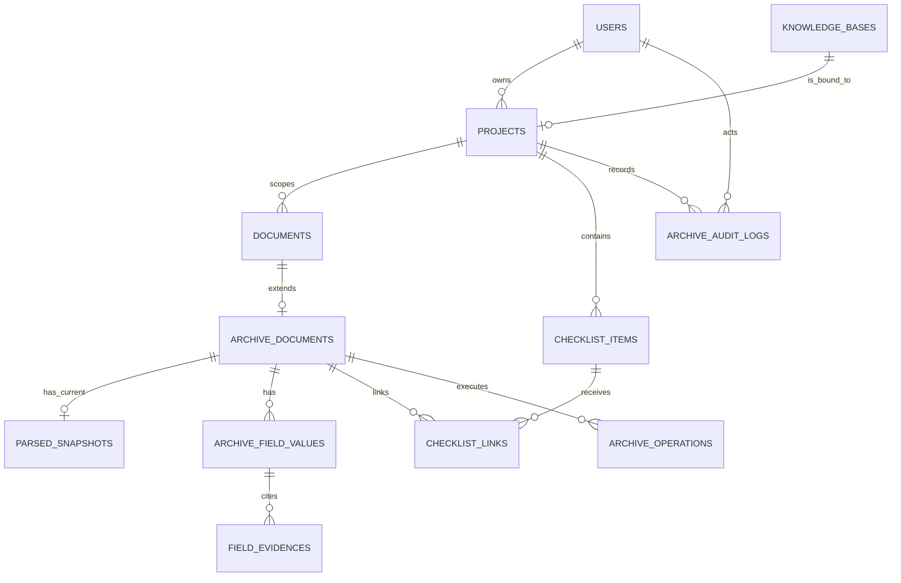

# 智慧档案与企业文档智能 V1 数据库与存储设计

## 1. 文档信息

| 项目 | 内容 |
|---|---|
| 对应基线 | `docs/requirements.md` V1.2 的 FR-030～FR-041、BR-008～BR-029、NFR-011～NFR-020；`docs/architecture.md` 已确认架构基线 |
| 文档状态 | 数据库设计基线已实现于 AV1-P03：归档模型及 `0005_archive_v1_schema`～`0008_legacy_business_comments` 已在空 PostgreSQL 实际前向迁移；`0009_chroma_vector_comments` 待真实库迁移验证；Chroma 代码/离线单测迁移已完成，归档 API 尚未实现 |
| 更新日期 | 2026-08-07 |
| PostgreSQL 角色 | 归档业务事实的唯一来源 |
| Chroma 角色 | 仅保存可重建的、已确认档案 Final Chunk 索引 |

本文件定义智慧档案 V1 的逻辑表、约束、索引、跨存储标识和迁移边界。当前 PostgreSQL
已通过 `0005_archive_v1_schema` 创建归档表；`0006_archive_jsonb_and_comments` 将归档 JSON
结构标准化为 JSONB 并写入归档表/字段注释，`0007_project_version_comment` 补齐项目乐观锁
字段注释，`0008_legacy_business_comments` 补齐既有 RAG、聊天和 Agent 业务表注释。这些迁移
不转换既有企业制度检索 Agent 的文档数据，也不表示归档业务 API 已经实现。

## 2. 设计原则与存储边界

1. PostgreSQL 保存项目、归档状态、字段、证据、清单、关联、操作和审计；Chroma
   不单独决定档案是否正式可见。
2. 旧 `documents` 表继续保存原文件身份；新 `archive_documents` 扩展表保存七种
   用户可见归档状态。不得复用旧 `DocumentStatus` 代替归档状态。
3. 一个 `projects` 记录恰好绑定一个 `knowledge_bases` 记录；项目是档案、清单、
   操作、目录与检索的隔离边界。
4. 原文件、解析快照和 Final Chunk 都以同一个 `document_id` 关联。删除成功后物理
   清理业务文档、文件、快照和向量；仅保留脱敏删除审计。
5. LangGraph Checkpoint 保持独立 SQLite 文件，不保存任何归档业务事实，也不与
   本设计中的表建立外键。
6. 所有 PostgreSQL 业务表和字段必须写入 `COMMENT`；注释用于数据库客户端、迁移审查和运维核查，不承载业务规则本身。`alembic_version` 是迁移工具元数据表，不属于此范围。

| 存储 | 保存内容 | 不能承担的职责 |
|---|---|---|
| PostgreSQL 16 | 业务事实、状态、字段、证据、清单、操作、审计 | 向量相似度检索 |
| 文件系统 | 原文件、位置感知解析快照 | 正式可见性判断 |
| Chroma | 已确认文档的 Chunk、向量与引用元数据 | 档案确认、清单满足、权限真相 |
| Checkpoint SQLite | 旧 Agent 的可序列化执行状态 | 项目、档案和审计数据 |

## 3. 与现有表的关系

### 3.1 保留的旧表

`users`、`knowledge_bases`、`documents`、聊天表、旧 Agent 会话表和工具日志表继续
存在。它们服务于当前企业知识库/制度检索基座，不能因新增智慧档案而被删除或改变
其历史含义。

### 3.2 `documents` 的受控改造

`documents` 仍是原文件的全局身份表，继续提供 `document_id`、文件名和原文件路径。
智慧档案文档必须额外具有一个 `archive_documents` 扩展记录；旧知识库文档没有该
扩展记录，且 `project_id` 为空。

| 变更 | 设计目的 |
|---|---|
| `content_hash` 重命名为 `file_hash` | 明确它是原始上传字节的 SHA-256，而非解析文本哈希 |
| 新增可空 `project_id` | 让归档文档由项目直接归属；旧知识库文档保持为空 |
| 新增 `(project_id, file_hash)` 唯一约束 | 同项目重复上传原文件时由数据库兜底；不同项目允许相同哈希 |
| 保留旧 `status` 字段 | 仅兼容旧知识库链路；归档 API 不读取它作为业务状态 |

归档上传时，服务必须同时设置 `documents.kb_id = projects.kb_id` 和
`documents.project_id = projects.id`。数据库通过复合外键保证项目与知识库匹配：
`(documents.project_id, documents.kb_id)` 引用 `projects(id, kb_id)`。

旧 `documents.status` 不迁移为归档状态。归档的处理列表、正式目录、确认、删除与
检索闸门只读取 `archive_documents.status` 和 `archive_operations`。

## 4. PostgreSQL 实体关系



## 5. 枚举与固定字典

除非需求文档明确扩展，以下枚举在 V1 采用 PostgreSQL Enum 或等价的数据库
`CHECK` 约束，禁止客户端提交未列出的值。

| 名称 | 值 |
|---|---|
| `archive_document_status` | `UPLOADED`、`PARSE_FAILED`、`PARSED`、`SUGGESTION_FAILED`、`PENDING_CONFIRMATION`、`CONFIRMED`、`PENDING_RECONFIRMATION` |
| `archive_field_name` | `TITLE`、`DOCUMENT_TYPE`、`DOCUMENT_DATE`、`AUTHORING_ORGANIZATION`、`VERSION_NUMBER`、`PROJECT_STAGE`、`KEYWORDS` |
| `field_review_status` | `PENDING_CHECK`、`VALUE_CONFIRMED`、`EMPTY_ACCEPTED` |
| `field_source` | `AI`、`MANUAL` |
| `document_type` | `CONTRACT`、`DESIGN`、`CONSTRUCTION`、`MEETING_MINUTES`、`ACCEPTANCE`、`OTHER` |
| `project_stage` | `PREPARATION`、`DESIGN`、`CONSTRUCTION`、`ACCEPTANCE`、`CROSS_STAGE`、`OTHER_STAGE` |
| `evidence_location_type` | `PDF_PAGE`、`DOCX_PARAGRAPH`、`TEXT_LINE_RANGE` |
| `checklist_link_status` | `CONFIRMED`、`INVALIDATED` |
| `archive_operation_type` | `PARSE`、`SUGGEST`、`INDEX`、`DELETE` |
| `archive_operation_status` | `RUNNING`、`SUCCEEDED`、`FAILED` |

数据库中保存稳定英文枚举值；Swagger/API 负责映射需求文档中的中文资料类型和阶段名称。

## 6. 表设计

### 6.1 `projects`

项目是当前普通用户的档案隔离入口，同时拥有一个独立知识库范围。

| 字段 | 类型/约束 | 说明 |
|---|---|---|
| `id` | UUID PK | 项目 ID |
| `owner_id` | UUID NOT NULL FK → `users.id` | 项目所有者 |
| `kb_id` | UUID NOT NULL FK → `knowledge_bases.id`，UNIQUE | 项目唯一绑定的知识库 |
| `name` | VARCHAR(200) NOT NULL | 已去除首尾空格的项目名称 |
| `description` | TEXT NULL | 项目说明 |
| `uses_demo_checklist` | BOOLEAN NOT NULL DEFAULT FALSE | 创建时是否复制虚构演示清单 |
| `active_document_count` | SMALLINT NOT NULL DEFAULT 0 | 当前未删除文档数，范围 0～100 |
| `version` | INTEGER NOT NULL DEFAULT 1 | 乐观并发版本 |
| `created_at` / `updated_at` | TIMESTAMPTZ NOT NULL | UTC 时间 |

约束与索引：

- `UNIQUE (owner_id, name)`；服务在写入前 `trim`，数据库再以
  `CHECK (name = btrim(name) AND char_length(name) > 0)` 兜底。
- `UNIQUE (id, kb_id)`，供 `documents(project_id, kb_id)` 的复合外键引用。
- `CHECK (active_document_count BETWEEN 0 AND 100)`。
- 索引：`(owner_id, updated_at DESC, id DESC)`，用于本人项目列表。
- 客户端不提交 `kb_id`；创建项目的服务在同一业务事务中创建或绑定一个同属
  `owner_id` 的知识库，再写入项目映射。`projects.kb_id` 与 `projects.owner_id` 的
  跨表所有者一致性由该受控服务保证。
- V1 按原需求采用区分大小写的名称唯一性；若后续需要忽略大小写，必须先变更需求与
  唯一索引，不能由 API 悄悄改变语义。
- 创建清单项的服务必须在同一事务中校验 `projects.version`、创建清单项、写审计并使
  项目版本加一；这为无 `Idempotency-Key` 的清单创建提供并发与重放保护。
- 删除空项目时保留其 `kb_id` 指向的 `knowledge_bases` 记录。该知识库可能仍承载旧
  RAG/Agent 练习文档；项目删除只清理项目及其级联项目数据，不承担旧知识库生命周期管理。

### 6.2 `documents`（既有原文件表）

| 字段 | V1 处理 |
|---|---|
| `id` | 保持 UUID PK，并作为所有存储的 `document_id` |
| `kb_id` | 保持；归档文档必须等于所属项目的 `kb_id` |
| `project_id` | 新增 UUID NULL；归档文档非空，旧知识库文档为空 |
| `filename`、`storage_path` | 保持；`storage_path` 不经 API 返回 |
| `file_hash` | 由旧 `content_hash` 重命名；`CHAR(64)`，SHA-256 原文件字节 |
| `status`、`chunk_count`、`error_message` | 保留给旧链路；不是归档领域真相 |
| 时间字段 | 保持 UTC `TIMESTAMPTZ` |

约束与索引：

- `FOREIGN KEY (project_id, kb_id) REFERENCES projects(id, kb_id)`；当 `project_id`
  为 `NULL` 时不影响旧知识库文档。
- `UNIQUE (project_id, file_hash)`；PostgreSQL 对 `NULL` 不等，因此旧文档不被该
  约束互相限制。
- 索引：`(project_id, created_at DESC, id DESC)` 与保留的 `kb_id`、文件名索引。

### 6.3 `archive_documents`

归档聚合以 `document_id` 一对一扩展原文件，不复制文件名、路径或原文件哈希。

| 字段 | 类型/约束 | 说明 |
|---|---|---|
| `document_id` | UUID PK/FK → `documents.id` ON DELETE CASCADE | 归档文档身份 |
| `status` | `archive_document_status` NOT NULL | 七种用户可见状态的唯一事实 |
| `current_snapshot_id` | UUID NULL UNIQUE | 当前解析快照；解析成功后必填 |
| `confirmed_by` | UUID NULL FK → `users.id` | 最后一次确认人 |
| `confirmed_at` | TIMESTAMPTZ NULL | 最后一次确认时间 |
| `final_index_snapshot_hash` | CHAR(64) NULL | 当前 Final Chunk 所基于的快照哈希 |
| `final_chunk_count` | INTEGER NOT NULL DEFAULT 0 | 当前正式索引 Chunk 数 |
| `last_error_code` | VARCHAR(64) NULL | 稳定、面向客户端的最近失败代码 |
| `last_error_summary` | VARCHAR(500) NULL | 受控失败摘要，不保存堆栈 |
| `version` | INTEGER NOT NULL DEFAULT 1 | 字段草稿、确认等提交的乐观并发版本 |
| `created_at` / `updated_at` | TIMESTAMPTZ NOT NULL | UTC 时间 |

约束与索引：

- `CHECK (final_chunk_count >= 0)`。
- `CONFIRMED` 时必须有 `confirmed_by`、`confirmed_at`、`current_snapshot_id` 和
  非空 `final_index_snapshot_hash`；其他状态不能据此推断正式可见性。
- 索引：`(status, confirmed_at DESC, id DESC)`、`(status, updated_at DESC, id DESC)`。
- `current_snapshot_id` 的完整外键在 `parsed_snapshots` 建表后补充，以避免循环建表；
  服务还必须校验快照属于同一 `document_id`。

### 6.4 `parsed_snapshots`

每个归档文档只保留一个当前、可重建的解析快照。它不是档案版本历史。V1 中普通解析
仅允许从 `UPLOADED` 发起、重新解析仅允许从 `PARSE_FAILED` 发起（该状态无成功快照），
因此快照一旦创建在 V1 内不会被替换。若未来开放已解析文档的重新解析，需同步设计
`field_evidences.snapshot_id`（`ON DELETE RESTRICT`）与快照替换的关联迁移策略。

| 字段 | 类型/约束 | 说明 |
|---|---|---|
| `id` | UUID PK | 快照 ID |
| `document_id` | UUID NOT NULL UNIQUE FK → `archive_documents.document_id` ON DELETE CASCADE | 所属归档文档 |
| `snapshot_storage_path` | VARCHAR(1024) NOT NULL | 服务器快照路径，不经 API 直接返回 |
| `snapshot_hash` | CHAR(64) NOT NULL | 规范化位置感知快照的 SHA-256 |
| `parser_name` / `parser_version` | VARCHAR(100) NOT NULL | 解析器身份与版本 |
| `normalization_version` | VARCHAR(50) NOT NULL | 快照规范化算法版本 |
| `text_character_count` | INTEGER NOT NULL | 有效文本字符数 |
| `fragment_count` | INTEGER NOT NULL | 位置感知片段数量 |
| `created_at` | TIMESTAMPTZ NOT NULL | 解析成功时间 |

`snapshot_hash` 的输入固定为规范化后的有序片段序列，至少包含片段文本、定位类型、
起止定位值和解析/规范化版本。它不等同于原始文件的字节哈希，也不参与重复上传判断。

约束与索引：`CHECK (text_character_count > 0)`、`CHECK (fragment_count > 0)`、
`UNIQUE (document_id)`。有效文本阈值由解析设计和实现计划确定，不在本表以魔法数固定。

### 6.5 `archive_field_values`

每份归档文档恰有七行字段草稿。无 AI 建议的手工路径创建七行空值、
`PENDING_CHECK` 的草稿；标题与资料类型不能在最终确认时为空。

| 字段 | 类型/约束 | 说明 |
|---|---|---|
| `id` | UUID PK | 字段记录 ID |
| `document_id` | UUID NOT NULL FK → `archive_documents.document_id` ON DELETE CASCADE | 所属档案 |
| `field_name` | `archive_field_name` NOT NULL | 七个固定字段之一 |
| `text_value` | TEXT NULL | 标题、类型、单位、版本、阶段等文本值 |
| `date_value` | DATE NULL | 仅文档日期使用 |
| `json_value` | JSONB NULL | 仅关键词使用，保存字符串数组 |
| `review_status` | `field_review_status` NOT NULL | 待检查、确认有值、接受为空 |
| `source` | `field_source` NULL | AI 或人工；尚未填写时为空 |
| `no_source_evidence` | BOOLEAN NOT NULL DEFAULT FALSE | 人工录入且无原文证据时为真 |
| `updated_by` | UUID NULL FK → `users.id` | 最近修改人 |
| `updated_at` | TIMESTAMPTZ NOT NULL | 最近修改时间 |

约束与索引：

- `UNIQUE (document_id, field_name)`，保证每文档仅有七个固定字段各一行。
- 文档日期只能使用 `date_value`；关键词只能使用非空 JSON 字符串数组；其他字段只能
  使用 `text_value`。这些按 `field_name` 的列互斥规则用 `CHECK` 约束实现。
- `EMPTY_ACCEPTED` 时三个值列必须都为空；`VALUE_CONFIRMED` 时必须有对应类型的值。
- `source = AI` 只允许建议服务写入；用户通过字段或证据接口保存任何修改时，服务必须写为
  `MANUAL`，使“重新生成建议”能够可靠识别人工编辑。
- `TITLE`、`DOCUMENT_TYPE` 在档案确认 SQL 校验中必须是 `VALUE_CONFIRMED` 且非空；
  不把原文件名写入字段值。
- 索引：为正式目录建立部分索引，分别覆盖已确认的 `DOCUMENT_TYPE`、
  `PROJECT_STAGE`、`DOCUMENT_DATE` 与 `AUTHORING_ORGANIZATION`；索引过滤条件不能
  单独决定正式可见性，仍需连接 `archive_documents.status = CONFIRMED`。

“每份文档恰有七个字段”“所有字段均已检查”“AI 非空字段有当前文档证据”属于跨行、
跨表不变量，不能由单行 `CHECK` 完整表达。确认服务必须在同一 PostgreSQL 事务中
执行聚合校验后才可将文档写为 `CONFIRMED`；数据库集成测试必须覆盖该校验，不能把它
留给客户端。

### 6.6 `field_evidences`

证据保存字段的原文摘录与位置，AI 提出的任何非空字段至少应关联一条本表记录。

| 字段 | 类型/约束 | 说明 |
|---|---|---|
| `id` | UUID PK | 证据 ID |
| `field_value_id` | UUID NOT NULL FK → `archive_field_values.id` ON DELETE CASCADE | 所属字段 |
| `snapshot_id` | UUID NOT NULL FK → `parsed_snapshots.id` ON DELETE RESTRICT | 证据对应的解析快照 |
| `excerpt` | TEXT NOT NULL | 返回给用户的原文摘录 |
| `location_type` | `evidence_location_type` NOT NULL | PDF 页码、DOCX 段落或文本行范围 |
| `location_start` / `location_end` | INTEGER NOT NULL | 从 1 开始；单点位置取相同值 |
| `normalized_anchor` | VARCHAR(200) NULL | DOCX 等场景的规范化辅助摘录 |
| `created_at` | TIMESTAMPTZ NOT NULL | 创建时间 |

约束：`location_start >= 1`、`location_end >= location_start`；PDF 与 DOCX 要求
起止值相同，TXT/MD 可表示行号范围。服务在写入时校验证据快照、字段和文档属于同一
档案，防止跨文档引用。

人工无证据字段不创建虚假证据；它通过 `source = MANUAL`、`no_source_evidence = true`
明确表达，且不得进入问答依据。

### 6.7 `checklist_items`

只保存项目已复制或用户维护的清单项；不建立可复用、自定义模板表。虚构演示模板由
应用内固定定义，在创建项目时复制出五条项目数据。

| 字段 | 类型/约束 | 说明 |
|---|---|---|
| `id` | UUID PK | 清单项 ID |
| `project_id` | UUID NOT NULL FK → `projects.id` ON DELETE CASCADE | 所属项目 |
| `name` | VARCHAR(200) NOT NULL | 清单项名称 |
| `document_type` | `document_type` NOT NULL | 建议匹配和人工判断参考 |
| `is_required` | BOOLEAN NOT NULL | 必需/可选 |
| `project_stage` | `project_stage` NOT NULL | 建议匹配和人工判断参考 |
| `description` | TEXT NULL | 说明 |
| `version` | INTEGER NOT NULL DEFAULT 1 | 乐观并发版本 |
| `created_at` / `updated_at` | TIMESTAMPTZ NOT NULL | UTC 时间 |

索引：`(project_id, updated_at DESC, id DESC)`、`(project_id, is_required, project_stage)`。
清单项名称不设项目内唯一约束，以允许同名但阶段不同的项目资料要求。

### 6.8 `checklist_links`

档案与清单项关联是“满足”的人工确认事实，不能由资料类型或阶段自动生成。

| 字段 | 类型/约束 | 说明 |
|---|---|---|
| `id` | UUID PK | 关联 ID |
| `document_id` | UUID NOT NULL FK → `archive_documents.document_id` ON DELETE CASCADE | 已关联档案 |
| `checklist_item_id` | UUID NOT NULL FK → `checklist_items.id` ON DELETE CASCADE | 目标清单项 |
| `status` | `checklist_link_status` NOT NULL | 已确认或已失效 |
| `confirmed_by` / `confirmed_at` | UUID FK / TIMESTAMPTZ NULL | 人工确认信息 |
| `invalidated_at` / `invalidated_reason` | TIMESTAMPTZ / VARCHAR(200) NULL | 清单核心条件变更时记录失效 |
| `version` | INTEGER NOT NULL DEFAULT 1 | 乐观并发版本 |
| `created_at` / `updated_at` | TIMESTAMPTZ NOT NULL | UTC 时间 |

约束与索引：

- `UNIQUE (document_id, checklist_item_id)`。
- `CONFIRMED` 时必须有确认人和确认时间；`INVALIDATED` 时必须有失效时间和原因。
- 服务必须验证文档与清单项属于同一项目。该跨表项目一致性由应用服务和项目上下文
  强制，不接受客户端传入可替换的项目归属。
- 索引：`(checklist_item_id, status)`、`(document_id, status)`。

清单满足查询必须同时满足：文档 `status = CONFIRMED` 且关联 `status = CONFIRMED`。
修改清单项的名称、资料类型或阶段时，将受影响关联更新为 `INVALIDATED`；只修改说明
不改变关联状态。

### 6.9 `archive_operations`

本表保存内部可恢复操作，不作为用户可见文档状态或普通处理列表字段。

| 字段 | 类型/约束 | 说明 |
|---|---|---|
| `id` | UUID PK | 操作 ID |
| `document_id` | UUID NOT NULL FK → `archive_documents.document_id` ON DELETE CASCADE | 目标文档 |
| `operation_type` | `archive_operation_type` NOT NULL | 解析、建议、索引或删除 |
| `operation_status` | `archive_operation_status` NOT NULL | 运行中、成功、失败 |
| `visibility_blocking` | BOOLEAN NOT NULL DEFAULT FALSE | 是否阻断正式目录、检索与问答 |
| `attempt_no` | INTEGER NOT NULL DEFAULT 1 | 同一可恢复操作的执行次数 |
| `last_completed_step` | VARCHAR(64) NULL | 跨存储补偿的最后成功步骤 |
| `failure_code` / `failure_summary` | VARCHAR(64) / VARCHAR(500) NULL | 受控失败信息 |
| `started_at` / `finished_at` | TIMESTAMPTZ | 执行时间 |
| `created_at` / `updated_at` | TIMESTAMPTZ NOT NULL | 记录时间 |

约束与索引：

- `CHECK (attempt_no >= 1)`。
- `CHECK (visibility_blocking = FALSE OR operation_type = 'DELETE')`；V1 只有删除
  操作可以设置可见性阻断。
- 部分唯一索引：同一 `document_id` 至多存在一条 `operation_status = RUNNING` 的操作，
  防止 parse、suggest、confirm/index、delete 并行执行。
- 部分唯一索引：同一文档至多保留一条 `operation_type = DELETE` 且状态为
  `RUNNING` 或 `FAILED` 的未完成删除操作。再次删除恢复此记录，而不是创建并行记录。
- 索引：`(operation_status, updated_at)` 用于服务器恢复扫描；
  `(document_id, operation_type, created_at DESC)` 用于幂等检查。

删除开始必须先提交 `DELETE + RUNNING + visibility_blocking = true`，然后清理 Chroma、
文件和 PostgreSQL 子记录。外部清理失败时该记录保持阻断；成功后随物理删除的
`archive_documents` 级联清理。客户端不读取该表的内部堆栈或模型输入输出。

操作记录生命周期：

- `DELETE` 的 `RUNNING`/`FAILED` 记录保留至删除完成；删除成功后随
  `archive_documents` 物理删除级联清理。
- `PARSE`、`SUGGEST`、`INDEX` 每次进入终态后，服务清理同一文档、同一类型更早的
  终态记录，只保留最新一条；`RUNNING` 记录不清理，服务重启后按恢复索引扫描。
- 因此每份现存文档每种非删除操作至多保留一条终态记录，内部操作表规模有界。

### 6.10 `archive_audit_logs`

审计表只保存用户可查询的脱敏业务动作，不保存原文、完整字段、提示词或模型输出。

| 字段 | 类型/约束 | 说明 |
|---|---|---|
| `id` | UUID PK | 审计 ID |
| `project_id` | UUID NOT NULL FK → `projects.id` ON DELETE CASCADE | 查询隔离边界 |
| `actor_id` | UUID NOT NULL FK → `users.id` | 操作人 |
| `operation_type` | VARCHAR(64) NOT NULL | 受 API Pydantic Enum 约束的确认、字段修改、清单修改、关联、重试、重新生成或删除动作 |
| `resource_type` | VARCHAR(64) NOT NULL | `PROJECT`、`DOCUMENT`、`FIELD`、`CHECKLIST_ITEM`、`CHECKLIST_LINK` |
| `resource_id` | UUID NOT NULL | 资源标识；不设外键以保留删除后的脱敏引用 |
| `operation_id` | UUID NULL UNIQUE，无外键 | 内部操作的历史关联 ID；保证一次成功结果不重复写审计 |
| `redacted_summary` | JSONB NOT NULL | 只含允许展示的摘要字段 |
| `created_at` | TIMESTAMPTZ NOT NULL | UTC 时间 |

索引：`(project_id, created_at DESC, id DESC)`，支持分页；`(actor_id, created_at DESC)`。
项目物理删除时，项目审计随项目级联删除；文档物理删除时，文档审计保留在仍存在的
项目下，但只能返回资源 ID 与脱敏摘要。

`operation_type` 不复用内部 `archive_operation_type`，但其允许值在 API 设计中固定为
Pydantic Enum；其中 AI 重新生成使用 `SUGGESTION_REGENERATED`，与失败后的
`SUGGESTION_RETRIED` 区分。

内部操作清理不影响审计：`operation_id` 不设外键，审计查询不依赖对应操作记录仍存在。

## 7. 正式目录与清单的查询约束

### 7.1 文档处理列表

处理列表只从 `documents → archive_documents` 查询当前项目内的现存记录，不连接
Chroma。它可以返回七种归档状态和受控失败摘要，但不能把 `archive_operations` 的
内部状态、堆栈或模型信息作为用户状态返回。

### 7.2 正式档案目录

正式目录的固定基础条件为：

```sql
archive_documents.status = 'CONFIRMED'
AND NOT EXISTS (
  SELECT 1 FROM archive_operations op
  WHERE op.document_id = archive_documents.document_id
    AND op.visibility_blocking = TRUE
)
```

资料类型、阶段、文档日期和编制单位筛选由对应 `archive_field_values` 行提供。人工
无原文证据字段可在档案详情显示，但不得作为问答证据或写入 Final Chunk 元数据。

### 7.3 清单缺失计算

每个清单项的满足条件为存在同项目的：

```text
archive_documents.status = CONFIRMED
AND checklist_links.status = CONFIRMED
AND checklist_links.checklist_item_id = 当前清单项
```

必需项无满足关联显示“缺失”；可选项无满足关联显示“未提供”。没有清单项时不输出
“缺失”结论。该计算完全在 PostgreSQL 中完成，不调用 DeepSeek 或 Chroma。

## 8. 哈希、文件与快照

| 名称 | 位置 | 算法与输入 | 用途 |
|---|---|---|---|
| `file_hash` | `documents.file_hash` | SHA-256，原始上传文件的精确字节序列 | 当前项目内重复上传校验 |
| `snapshot_hash` | `parsed_snapshots.snapshot_hash`，并冗余写入 Final Chunk | SHA-256，规范化位置感知快照 | 确认证据、索引和快照对应关系 |

文件系统路径必须按 `document_id` 组织，避免使用用户提交的文件名作为目录或路径的一部分。

```text
<upload-root>/<document_id>/original
<snapshot-root>/<document_id>/current-snapshot.json
```

删除成功时移除两类文件；删除失败时只允许服务器通过未完成 `DELETE` 操作恢复，不创建
新的文档或重复文件。

## 9. Chroma Final Collection 设计

智慧档案必须使用与旧制度检索分离的 Collection，例如 `archive_final_chunks`。只有
`CONFIRMED` 档案在确认成功时写入；待确认、待重新确认、失败和删除阻断文档不得写入
或参与检索。

| 字段 | 类型 | 说明 |
|---|---|---|
| `id`（稳定 `chunk_id`） | Chroma 字符串记录 ID | 同一文档重建时精确替换 |
| `embedding` | Chroma 向量 | 维度由实际 BGE 模型固定；C01/C02 验证后记录，不在 PostgreSQL Schema 中硬编码 |
| `document` | Chroma 文本 | 被检索的原文 Chunk |
| `user_id` / `project_id` / `kb_id` / `document_id` | 字符串元数据 | 服务端注入的隔离字段 |
| `snapshot_hash` / `parser_version` | 字符串元数据 | 快照与定位语义追溯 |
| `filename` / `location_type` / `excerpt_anchor` | 字符串元数据 | 引用展示与辅助定位 |
| `location_start` / `location_end` | 整数元数据 | 页码、段落或行号引用 |

Chroma 写入、查询和删除都必须由服务端构造 `where` 过滤条件，至少包含
`user_id + project_id + kb_id + document_id`。正式检索还必须先由 PostgreSQL 获得
`CONFIRMED` 且无可见性阻断的 `document_id` 集合，再传给 Chroma；Chroma 中孤立的
Chunk 不能绕过这道闸门。

Chroma Collection 的距离度量、返回距离方向和阈值只能在 AV1-C01/C02 完成后，由固定
验收集实测冻结；不得沿用旧 Milvus COSINE 阈值。Chroma 不是 PostgreSQL 迁移对象，
Collection 初始化、健康检查和重建验证必须随部署说明单独执行。

## 10. 一致性、事务与并发

| 动作 | PostgreSQL 事实 | 文件/Chroma动作 | 关键约束 |
|---|---|---|---|
| 上传 | 锁定项目计数，创建 `documents` 与 `archive_documents`，计数加一 | 保存原文件 | `UNIQUE(project_id, file_hash)`，上限 100 |
| 解析 | 建立/替换快照元数据，状态转 `PARSED` | 写快照文件 | `PARSE` 操作锁；普通解析幂等 |
| 建议/手工草稿 | 写七个字段和证据，更新版本 | 读取快照 | 不静默覆盖人工字段 |
| 确认 | 字段检查通过后写 `CONFIRMED` 与审计 | 写/替换 Final Chunk | `INDEX` 操作锁；向量成功后才确认 |
| 修改正式字段 | 先转 `PENDING_RECONFIRMATION` | 清理 Final Chunk | 正式目录立即排除 |
| 删除 | 创建可见性阻断删除操作，最终物理删除 | 删除向量、原文件和快照 | 失败保留未完成删除操作，计数不减 |

项目容量使用 `projects.active_document_count` 在项目行锁内原子维护，不能只用先查询
再插入的非原子计数。删除全部完成并实际移除文档记录后才减一；因此解析失败、待确认
和删除失败的文档都占用容量，符合需求中的“未删除文档”定义。

字段草稿、确认和清单项更新使用聚合/资源 `version` 做乐观锁；客户端使用旧版本提交
时返回业务冲突。数据库/API 设计后续需统一版本字段在请求和响应中的传递方式。

## 11. 迁移策略

已在现有 `0004_remove_leave_domain` 后新增 `0005_archive_v1_schema`，建立 V1 所需结构与约束；随后通过 `0006_archive_jsonb_and_comments` 标准化 JSONB 列并补齐归档 PostgreSQL 表/字段注释，`0007_project_version_comment` 补齐项目版本字段注释，`0008_legacy_business_comments` 补齐既有业务表和字段注释。迁移不把旧知识库文档自动变为项目档案。

迁移顺序：

1. 创建新枚举类型与 `projects`。
2. `documents.content_hash` 重命名为 `file_hash`，新增 `project_id`，补充复合外键、
   唯一约束和项目索引；同步更新旧代码的字段引用只能在实施阶段完成。
3. 创建 `archive_documents`、`parsed_snapshots`，再补充当前快照外键。
4. 创建字段、证据、清单、关联、操作和审计表及其索引。
5. 创建 `archive_final_chunks` 所需的 Chroma 初始化/校验逻辑；它不是 Alembic 表，
   但必须与 PostgreSQL 迁移版本在部署说明中配套验证。

回滚只允许在尚未写入 V1 业务数据的本地开发环境执行。已有归档数据时不得通过删除
迁移或 `alembic stamp` 掩盖状态，应使用新的前向迁移处理。

## 12. 数据库设计验收与实施事项

AV1-P03 已完成模型、迁移、目标 PostgreSQL 空库前向迁移和注释契约验证。以下行为仍须在
对应实现任务的数据库/API 测试中持续验证：

- 同一用户去除首尾空格后的项目名称唯一，不同用户可同名。
- 一个知识库不能绑定两个项目；归档文档的项目与知识库不能不匹配。
- 同项目同 `file_hash` 插入冲突，不同项目允许相同哈希。
- 每份归档文档只能有一份当前快照、七个唯一字段行和一个运行中内部操作。
- `CONFIRMED` 档案缺少确认信息、快照或索引哈希时无法提交。
- `DELETE + RUNNING + visibility_blocking` 立即从正式目录查询中排除文档。
- 删除后保留脱敏审计，不保留原文件、快照、字段、证据、关联或 Final Chunk。

API 契约已在 `docs/api-design.md` 固定：版本值使用请求体、删除恢复复用 `DELETE`、
字段响应和稳定错误码已有明确约定。`archive_final_chunks` 的实际字段长度、向量维度、
索引参数和相关性阈值必须按 `docs/review/verification-freeze-checklist.md` 的门槛 2
验证后冻结。

当前已创建 SQLModel 与 `0005`～`0008` Alembic 迁移。项目/清单 Router、Service 和 API
测试属于 AV1-P04；上传、状态机、Final Collection 和跨存储恢复属于后续任务，不能因
数据库结构已经存在而视为已实现。
