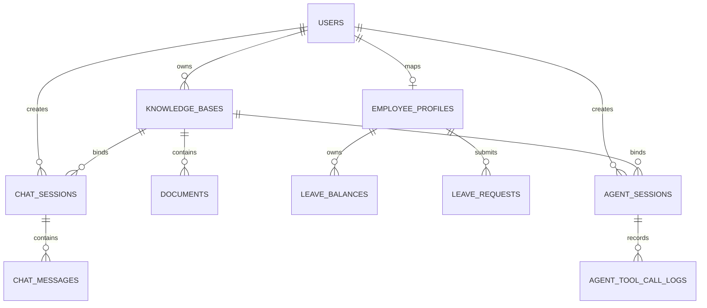

# 数据库与存储设计

## 存储职责

| 存储 | 内容 | 定位 |
| --- | --- | --- |
| 业务 SQLite | 用户、知识库、文档、RAG 会话、员工、请假和 Agent 审计 | 业务事实来源 |
| Checkpoint SQLite | LangGraph 消息、执行快照和待确认中断 | 可恢复运行状态，不作为业务事实 |
| 文件系统 | 上传原文件 | 重新解析来源 |
| Milvus | Chunk、引用元数据、Embedding | 可重建检索索引 |

## SQLite 关系



### 表结构

| 表 | 字段与约束 | 用途 |
| --- | --- | --- |
| `users` | `id` UUID PK；`name` 1..100 index；创建/更新时间 | 模拟用户身份；`name` 是可重复显示名称 |
| `knowledge_bases` | `id` UUID PK；`owner_id` FK/index；`name` 1..100 index；时间 | 所有权与知识库信息 |
| `documents` | `id` UUID PK；`kb_id` FK/index；`filename` index；`storage_path`；`content_hash` index；`status` index；`chunk_count`；`error_message`；时间 | 原文件身份和处理状态 |
| `chat_sessions` | `id` UUID PK；`user_id` FK/index；`kb_id` FK/index；时间 | 固定用户和知识库范围 |
| `chat_messages` | `id` UUID PK；`session_id` FK/index；`role` index；`content`；`sources_json`；`created_at` index | 问答历史和引用快照 |
| `employee_profiles` | `id` UUID PK；`user_id` FK/unique；`employee_no` unique/index；`department` nullable；`active`；时间 | 将当前用户映射为唯一员工身份 |
| `leave_balances` | `id` UUID PK；`employee_id` FK/index；`leave_type`；`total_days`；`used_days`；员工与类型联合唯一；时间 | 年假、病假额度与已用天数 |
| `leave_requests` | `id` UUID PK；`employee_id` FK/index；`leave_type`；`start_date`/`end_date`；`leave_days`；`reason`；`status` index；`idempotency_key` unique；时间 | 经确认创建的请假申请 |
| `agent_sessions` | `id` UUID PK；`user_id`/`kb_id` FK/index；`thread_id` unique；时间 | 固定 Agent 用户、知识库和 Graph thread |
| `agent_tool_call_logs` | `id` UUID PK；`agent_session_id` FK/index；`tool_call_id` index；工具名、状态、参数/结果摘要 JSON、耗时、错误码、时间 | 脱敏工具调用审计 |

假期类型为 `ANNUAL`、`SICK`；当前申请状态为 `SUBMITTED`。被用户拒绝的草稿不写入 `leave_requests`，拒绝事实由 Checkpoint 和工具调用日志记录。

文档状态：`UPLOADED`、`PROCESSING`、`READY`、`FAILED`、`DELETING`、`DELETE_FAILED`。

## Milvus Collection

默认名 `mini_rag_handwrite_chunks`，`auto_id=False`，`enable_dynamic_field=False`。

| 字段 | 类型 | 用途 |
| --- | --- | --- |
| `chunk_id` | VARCHAR(64) PK | 稳定 SHA-256 身份 |
| `user_id` / `kb_id` / `document_id` | VARCHAR(36) | 隔离、归属和文档级删除 |
| `document_name` | VARCHAR(1024) | 来源展示 |
| `page` / `start_index` / `chunk_index` | INT64 | 页码、页内位置、文档顺序 |
| `content` | VARCHAR(8192) | 检索正文、Prompt、摘录 |
| `content_hash` | VARCHAR(64) | 正文指纹 |
| `embedding` | FLOAT_VECTOR(512) | BGE 归一化向量 |

向量索引为 `AUTOINDEX + COSINE`。维度由配置决定，必须与已有 Collection 一致。

## 跨存储映射

```text
users.id → Milvus.user_id
knowledge_bases.id → Milvus.kb_id
documents.id → <FILE_STORAGE>/<kb_id>/<document_id>/<filename>
documents.id → Milvus.document_id（0..n 个 Chunk）
agent_sessions.thread_id → Checkpoint SQLite thread_id
agent_sessions.user_id + kb_id → Agent 运行时授权上下文
employee_profiles.user_id → 当前用户唯一员工身份
```

Checkpoint 与业务库不建立外键。删除 Agent 会话时，业务记录与 Checkpoint 清理采用明确的应用流程，不依赖跨库级联。

## 删除与一致性

```text
标记 DELETING → 按 user_id + kb_id + document_id 删除 Milvus
→ 校验路径后删除原文件 → 删除 SQLite Document
```

失败保留记录并标记 `DELETE_FAILED`。已不存在的文件或 Chunk 视为成功，支持重试。重新解析同样先按三字段删除旧 Chunk。

## 当前限制

- 只有单字段索引，没有显式复合索引。
- 已建立 `0001_rag_baseline` 和 `0002_leave_domain` 两个 Alembic 迁移；正式启动执行迁移，`create_all()` 只用于隔离测试。
- 模型声明外键，但未显式启用 SQLite `PRAGMA foreign_keys=ON`，不能断言运行时强制外键。
- 用户名、知识库名和文档哈希没有唯一约束。

## 已确认的未来变更

- `0001_rag_baseline` 可创建空库，或验证旧 Schema 后接管并保留数据；`0002_leave_domain` 独立新增员工、余额和请假申请表。
- 业务库与 Checkpoint 库使用不同配置路径和不同连接生命周期。

- 显示名称 `name` 继续允许重复。
- 登录系统需要为用户新增唯一邮箱和密码哈希字段。不得保存明文密码；邮箱规范化规则和密码哈希算法尚待设计。认证使用 Access Token + Refresh Token，并在 SQLite 持久化 Refresh Token 哈希和撤销状态。

### 计划新增的登录会话表

| 字段 | 约束方向 | 用途 |
| --- | --- | --- |
| `id` | UUID，PK | 登录会话身份，并可作为 Token 会话标识 |
| `user_id` | UUID，FK/index | 登录会话所属用户 |
| `refresh_token_hash` | 唯一、不可逆哈希 | 校验 Refresh Token，不保存明文 |
| `expires_at` | UTC datetime，index | 判断 Refresh Token 是否过期 |
| `revoked_at` | nullable UTC datetime，index | 非空表示已退出或主动撤销 |
| `created_at` / `updated_at` | UTC datetime | 审计和状态更新时间 |

表名、哈希算法以及是否记录设备信息将在认证技术方案中最终确定。Access Token 不写入数据库。
- 只需要知识库修改、删除能力；用户资料修改和账号删除不在计划内。
- 知识库删除不设置级联：删除前检查 `documents.kb_id` 和 `chat_sessions.kb_id`，任一关联记录存在都拒绝删除。

## 待确认

Refresh Token 不执行轮换，因此一个登录会话只保存当前 Refresh Token 的哈希，直到过期或退出撤销。

1. `[TODO]` 复合索引只在迁移步骤根据实际查询确定，不为展示提前增加无证据索引。

## 证据

- `app/models/account.py`、`document.py`、`chat.py`、`leave.py`
- `migrations/versions/0001_rag_baseline.py`、`0002_leave_domain.py`
- `tests/test_migrations.py`、`tests/test_leave_service.py`
- `app/db.py::create_db_and_tables`
- `app/services/vector_service.py::ensure_chunk_collection`
- `app/services/file_service.py`、`app/services/document_service.py`
